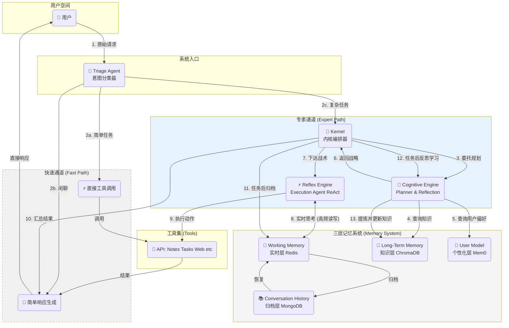
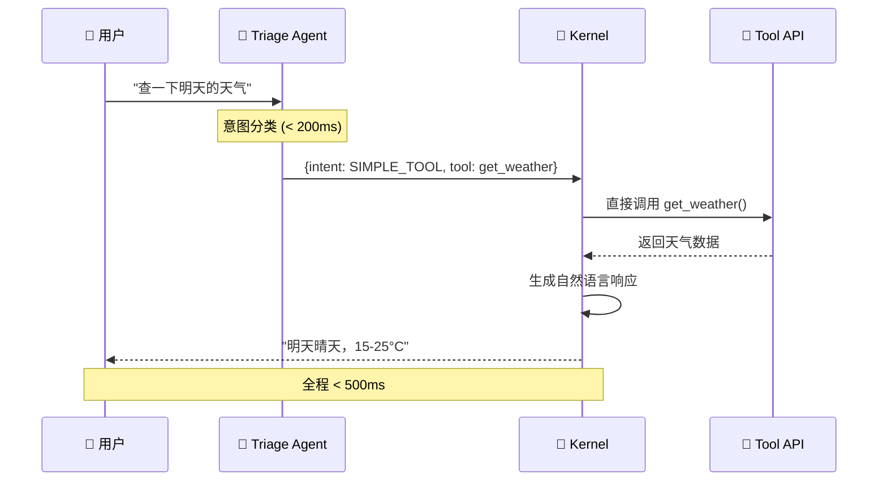
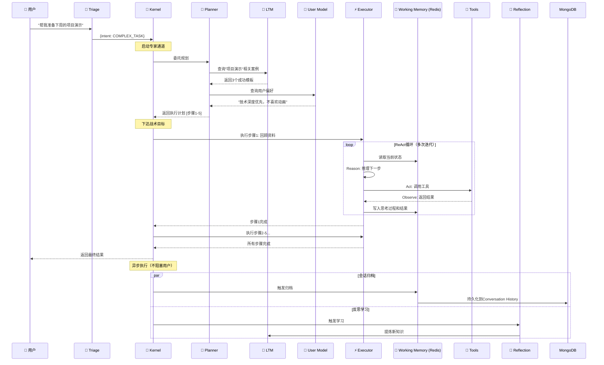
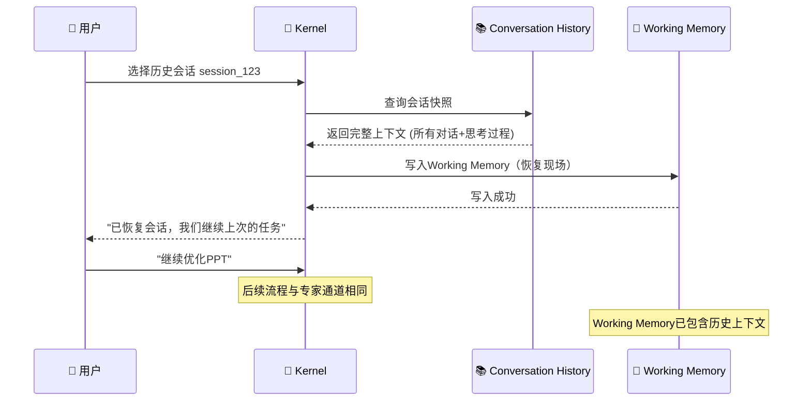
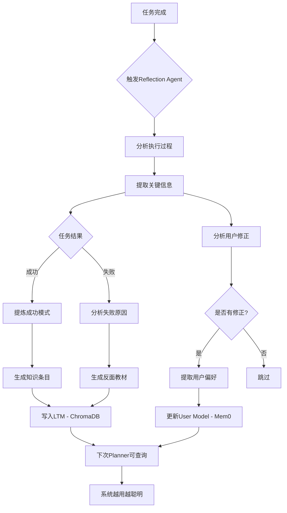
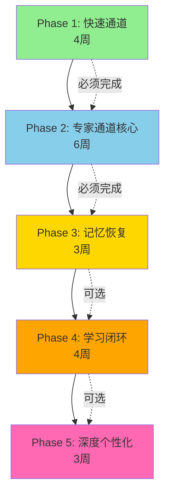

# AI认知助手系统架构设计文档

> **📌 实施状态说明**
> - **当前状态**: ❌ **未实现** - 本文档为目标架构设计
> - **现有实现**: 使用LangGraph实现的Task Igniter Agent (任务分解功能)
> - **未来计划**: 完整的双通道架构、三层记忆系统、学习闭环尚未实施
> - **技术栈差异**: 文档描述使用Redis+MongoDB+ChromaDB+Mem0，当前仅使用SQLite+ChromaDB
>
> 本文档描述的是**长期愿景架构**，而非当前系统状态。实际开发请参考 `后端详细设计.md` 了解当前实现。

---

**版本**: v1.0
**创建日期**: 2025-11-18
**文档类型**: 目标架构设计
**目标受众**: 技术团队（开发工程师、架构师）

---

## 文档摘要

本文档描述了Personal Growth OS项目的AI认知助手系统的**目标架构**。该架构基于认知科学的双系统理论，采用"快速通道 + 专家通道"的混合模式，配合三层记忆系统，旨在构建一个能够**主动规划、动态适应、持续学习并深度个性化**的AI认知伙伴。

**核心设计**：
- **双通道架构**: 快速通道（低延迟）+ 专家通道（高质量）
- **双引擎模式**: Cognitive Engine（慢思考）+ Reflex Engine（快思考）
- **三层记忆**: Working Memory（实时）+ Conversation History（归档）+ Long-Term Memory（知识）
- **学习闭环**: Reflection Agent实现系统自我优化

---

## 目录

1. [系统愿景与设计理念](#1-系统愿景与设计理念)
2. [核心架构原则](#2-核心架构原则)
3. [系统架构总览](#3-系统架构总览)
4. [核心组件详解](#4-核心组件详解)
5. [核心工作流程详解](#5-核心工作流程详解)
6. [技术选型方案](#6-技术选型方案)
7. [实施路线图](#7-实施路线图)
8. [架构决策记录（ADR）](#8-架构决策记录adr)
9. [风险与挑战](#9-风险与挑战)
10. [未来演进方向](#10-未来演进方向)

---

## 1. 系统愿景与设计理念

### 1.1 核心使命：从问答机器人到认知伙伴

我们要构建的，不是一个简单的问答机器人，而是一个能够成为用户"第二大脑"的AI认知伙伴。它的核心使命是：

**对抗拖延** - 通过降低行动的初始摩擦力，将想法转化为行动
**固化知识** - 通过无缝记录与智能重现，对抗"学后即忘"
**驱动复盘** - 通过数据驱动的洞察，将经验转化为优化策略

这要求系统具备四大核心能力：
1. **主动规划**: 不仅回答问题，更能主动拆解复杂任务、制定执行策略
2. **动态适应**: 根据执行过程中的反馈实时调整策略，而非僵化执行
3. **持续学习**: 从每次交互中提炼经验，系统越用越聪明
4. **深度个性化**: 理解每个用户的独特偏好，提供千人千面的服务

### 1.2 设计哲学：双系统理论的工程实践

本架构的设计哲学源自认知心理学的**双系统理论**（Daniel Kahneman, *Thinking, Fast and Slow*）：

**系统1（快思考）**：
- 特点：快速、自动、直觉式
- 优势：低延迟、低成本
- 局限：不适合复杂推理

**系统2（慢思考）**：
- 特点：慢速、需要努力、深思熟虑
- 优势：能处理复杂问题、做出高质量决策
- 局限：耗时、成本高

我们将这一理论映射到系统架构：

| 认知理论 | 系统架构 | 适用场景 | 性能目标 |
|---------|---------|---------|---------|
| **系统1（快思考）** | 快速通道 + Reflex Engine | 简单工具调用（查天气、创建任务） | 响应 < 500ms |
| **系统2（慢思考）** | 专家通道 + Cognitive Engine | 复杂任务（准备演示、写周报） | 质量 > 速度 |

### 1.3 v3.1混合架构的诞生：为什么需要两条通道并存

**问题背景**：
用户请求的复杂度差异极大：
- 简单请求："查一下明天的天气"
- 复杂请求："帮我准备下周的项目演示"

**单通道方案的问题**：
- **纯快速通道**: 无法处理复杂任务，规划能力严重不足
- **纯专家通道**: 简单任务也要经过完整的规划-执行-学习流程，延迟高、成本高

**混合架构的优势**：
- 简单任务走快速通道，绕过所有认知引擎，极致低延迟
- 复杂任务走专家通道，充分利用规划、学习能力，保证质量
- 成本结构分离：简单任务LLM调用 < 3次，复杂任务可能 > 10次

**核心设计决策**：
> 让**Triage Agent**在系统入口处快速分类意图，根据复杂度路由到对应通道，实现"简单任务简单办，复杂任务深度办"。

---

## 2. 核心架构原则

本架构遵循以下四大设计原则：

### 2.1 单一职责原则（Single Responsibility Principle）

**定义**: 每个组件只做一件事，并把这件事做好。

**应用**：
- **Triage Agent**: 只做意图分类，不执行任务
- **Kernel**: 只做编排路由，不执行具体逻辑
- **Planner**: 只做战略规划，不关心执行细节
- **Executor**: 只做战术执行，不做高层决策

**好处**：
- 组件边界清晰，易于理解和维护
- 职责解耦，便于独立测试和优化
- 团队可并行开发不同组件

### 2.2 分层解耦原则（Layered Decoupling）

**架构分层**：
```
用户层 → Triage层 → Kernel层 → Engine层 → Memory层 → Tool层
```

**层间交互规则**：
- 上层可调用下层，下层不可调用上层
- 跨层调用必须通过明确的接口（API/消息队列）
- 每层的变更不应影响其他层的实现

**好处**：
- 降低系统复杂度，每层只需关注自己的职责
- 便于替换实现（如更换LLM提供商、更换数据库）
- 有利于分布式部署（不同层可部署在不同服务器）

### 2.3 可观测性原则（Observability）

**定义**: 系统的所有决策过程都应可追溯、可复盘。

**实现方式**：
- **完整日志**: 记录Triage分类结果、Planner的规划过程、Executor的每次工具调用
- **状态快照**: Working Memory保存完整的思考轨迹和执行过程
- **性能指标**: 记录每个组件的延迟、成功率、LLM调用次数

**应用场景**：
- **调试**: 当AI行为异常时，可回溯完整执行过程定位问题
- **优化**: 分析哪些环节耗时最长，针对性优化
- **学习**: Reflection Agent依赖完整日志提炼经验

### 2.4 渐进增强原则（Progressive Enhancement）

**定义**: 系统功能应分阶段交付，从简单到复杂逐步演进。

**演进路径**：
```
Phase 1: 快速通道（简单工具调用）
  ↓
Phase 2: 专家通道核心（规划 + 执行）
  ↓
Phase 3: 记忆系统（会话恢复）
  ↓
Phase 4: 学习闭环（自我优化）
  ↓
Phase 5: 深度个性化（千人千面）
```

**好处**：
- 快速验证架构可行性，降低风险
- 每个阶段都有独立的用户价值，不必等到全部完成
- 允许根据用户反馈调整后续Phase的优先级

---

## 3. 系统架构总览

### 3.1 架构全景图



### 3.2 两条核心路径

#### 快速通道（Fast Path）
**特点**: 低延迟、高吞吐、低成本

**适用场景**：
- 单步工具调用（查天气、查询任务列表、创建笔记）
- 简单信息查询（"今天有哪些任务？"）
- 闲聊与确认（"好的"、"谢谢"）

**性能目标**：
- 端到端延迟 < 500ms
- LLM调用次数 ≤ 2次（Triage + 响应生成）

**核心流程**：
```
用户 → Triage → 直接调用工具API → 生成响应 → 用户
```

**绕过组件**: Kernel、Cognitive Engine、Reflex Engine、Working Memory

#### 专家通道（Expert Path）
**特点**: 高质量、深度规划、持续学习

**适用场景**：
- 多步骤任务（"帮我准备项目演示"）
- 需要规划的任务（"制定本周学习计划"）
- 需要上下文的对话（多轮对话、会话恢复）

**性能目标**：
- 任务完成质量 > 响应速度
- LLM调用次数 10-20次（Planner + ReAct循环 + Reflection）

**核心流程**：
```
用户 → Triage → Kernel → Planner(查询LTM/UserModel) →
Executor(ReAct循环读写Working Memory) → 归档 → Reflection学习
```

**涉及组件**: 全部组件（完整的认知-执行-学习闭环）

### 3.3 五大核心组件

| 组件 | 职责 | 关键能力 | 技术特点 |
|-----|------|---------|---------|
| **Triage Agent** | 意图分类 | 快速、低成本地识别用户意图 | 轻量级LLM（GPT-4o-mini） |
| **Kernel** | 编排路由 | 协调各组件协作，管理状态机 | 事件驱动 + 状态机 |
| **Cognitive Engine** | 战略规划 & 反思学习 | Planner制定策略，Reflection提炼经验 | 查询LTM和UserModel |
| **Reflex Engine** | 战术执行 | ReAct循环动态调用工具 | 高频读写Working Memory |
| **Memory System** | 三层记忆 | 实时/归档/知识三层存储 | Redis + MongoDB + ChromaDB |

---

## 4. 核心组件详解

本章详细阐述五大核心组件的设计，重点说明各组件的职责边界、设计原则和关键能力，不涉及具体代码实现。

### 4.1 Triage Agent（意图分类器）

#### 4.1.1 核心职责

Triage Agent是系统的"总前台"，负责对每个用户请求进行**快速、低成本的意图分类**。

**输入**: 用户的自然语言请求
**输出**: 结构化的分类结果 `{ intent, confidence, suggested_tool, params }`

#### 4.1.2 设计原则

**延迟优化**：
- 目标响应时间 < 200ms
- 使用轻量级LLM（如GPT-4o-mini、Claude Haiku）
- 避免复杂的推理链，只做简单分类

**成本优化**：
- 每次分类LLM Token消耗 < 500 tokens
- 通过Few-shot Prompting提升准确率，而非使用大模型

**准确性要求**：
- 召回率 > 95%（宁可误判为复杂任务，不可漏判）
- 对于模糊请求，倾向于分类为COMPLEX_TASK（保守策略）

#### 4.1.3 分类策略

Triage Agent将用户请求分为三大类：

**类型1：SIMPLE_TOOL_USE（简单工具调用）**
- **特征**: 单步操作、明确的工具调用、无需规划
- **示例**:
  - "查一下明天的天气"
  - "创建一个任务：写周报"
  - "列出所有待办任务"
- **处理方式**: 走快速通道，直接调用对应API

**类型2：COMPLEX_TASK（复杂任务）**
- **特征**: 多步骤、需要规划、需要上下文
- **示例**:
  - "帮我准备下周的项目演示"
  - "制定本周的学习计划"
  - "根据我的笔记总结最近学到的知识"
- **处理方式**: 走专家通道，启动完整的规划-执行-学习流程

**类型3：CHITCHAT（闲聊/确认）**
- **特征**: 无明确任务、社交性对话、确认性回应
- **示例**:
  - "你好"
  - "谢谢"
  - "好的，明白了"
- **处理方式**: 走快速通道，生成简单响应

#### 4.1.4 输出格式

```json
{
  "intent": "SIMPLE_TOOL_USE",
  "confidence": 0.95,
  "suggested_tool": "create_task",
  "params": {
    "title": "写周报",
    "priority": 3
  }
}
```

**字段说明**：
- `intent`: 分类结果（三选一）
- `confidence`: 置信度（0-1），低于0.7时降级为COMPLEX_TASK
- `suggested_tool`: 仅SIMPLE_TOOL_USE时填写，提示Kernel调用哪个工具
- `params`: 从用户请求中提取的参数

---

### 4.2 Kernel（内核编排器）

#### 4.2.1 核心职责

Kernel是系统的"操作系统"，负责接收Triage的分类结果，并协调各认知组件完成任务。类比操作系统的进程调度器，Kernel不执行具体任务，只负责编排。

**五大职责**：

**1. 路由分发**
- 根据Triage结果决定走快速通道还是专家通道
- 快速通道：直接调用工具API → 生成响应
- 专家通道：启动Planner → Executor → Reflection流程

**2. 组件编排**
- 协调Planner、Executor、Reflection的调用顺序
- 管理组件间的数据流（Planner的策略传递给Executor）
- 处理组件间的依赖关系（Executor完成后才触发Reflection）

**3. 状态管理**
- 维护任务执行的状态机：待执行 → 执行中 → 已完成/失败
- 跟踪任务进度（如5步任务完成到第3步）
- 支持任务暂停、恢复、取消

**4. 资源调度**（未来扩展）
- 管理并发请求（多个用户同时使用）
- 限流控制（防止LLM调用过载）
- 优先级队列（VIP用户优先处理）

**5. 错误处理**
- 重试策略：工具调用失败时自动重试（最多3次）
- 降级方案：LLM服务不可用时使用规则引擎
- 回滚机制：任务执行失败时恢复到初始状态

#### 4.2.2 设计模式

**事件驱动架构**：
- Kernel通过事件队列接收请求
- 异步处理，避免阻塞
- 支持事件重放（用于调试和复盘）

**状态机模式**：
```
[待执行] --启动--> [规划中] --完成--> [执行中] --完成--> [学习中] --完成--> [已完成]
                                  ↓ 失败
                                [失败] --重试--> [待执行]
                                  ↓ 超过重试次数
                                [终止]
```

#### 4.2.3 关键接口（概念）

**route(triage_result) → execution_path**
- 输入：Triage的分类结果
- 输出：执行路径（fast_path / expert_path）

**orchestrate(task) → execution_plan**
- 输入：用户任务
- 输出：组件调用计划（调用哪些组件、传递什么数据）

**handle_error(error) → recovery_action**
- 输入：错误信息
- 输出：恢复动作（重试 / 降级 / 通知用户）

---

### 4.3 Cognitive Engine（认知引擎 - 慢思考）

Cognitive Engine是系统的"大脑皮层"，负责需要深度思考的任务：战略规划和反思学习。

**核心特征**：
- 处理速度慢（秒级响应）
- 决策质量高（充分利用知识和经验）
- 不关心执行细节（只做"做什么"的决策）

Cognitive Engine包含两个子组件：

#### 4.3.1 Planner（战略规划器）

**职责**: 制定高层次执行策略（做什么，不管怎么做）

**输入**：
- 用户任务描述
- Long-Term Memory中的相关知识（成功案例）
- User Model中的用户偏好

**输出**：
- 结构化的执行计划（步骤列表）
- 每个步骤的目标和建议工具
- 预期结果

**核心能力**：

**1. 知识检索**
- 从Long-Term Memory查询与当前任务相似的历史案例
- 提取成功模式：例如"写周报"的标准步骤
- 参考失败教训：避免重复犯错

**2. 个性化调整**
- 从User Model查询用户的工作习惯和偏好
- 示例：用户喜欢先列提纲再写内容 → 规划时增加"列提纲"步骤
- 示例：用户不喜欢花哨动画 → 制作PPT时强调技术深度而非视觉效果

**3. 任务分解**
- 将复杂任务拆解为3-7个可执行的子任务
- 每个子任务应足够具体，Executor可直接执行
- 子任务之间有明确的依赖关系（串行/并行）

**输出示例**：

对于任务"准备项目演示"，Planner可能输出：

```
执行计划：
1. 回顾上次演示的材料（查询笔记中的"项目演示"标签）
2. 列出本次演示的核心要点（根据项目最新进展）
3. 制作PPT大纲（技术深度优先，不超过20页）
4. 补充技术细节和数据支撑
5. 准备Demo演示脚本
```

**设计要点**：
- Planner不执行，只规划（不调用工具，只描述"应该调用什么工具"）
- 规划结果可被Executor理解和执行
- 规划过程可追溯（记录为什么这样规划）

#### 4.3.2 Reflection（反思学习器）

**职责**: 任务结束后提炼经验，实现系统自我优化

**触发时机**：
- 任务完成后异步执行（不阻塞用户）
- 任务失败时立即执行（快速学习教训）

**学习内容**：

**1. 成功模式提炼**
- 分析哪些策略有效（Planner的规划是否合理？Executor调用了哪些工具？）
- 提取可复用的任务模板
- 存入Long-Term Memory作为未来参考

**示例**：
```
任务："写周报"
成功模式：
- 步骤1：查询本周完成的任务列表
- 步骤2：按项目分组整理
- 步骤3：提炼每个项目的关键成果
- 步骤4：生成Markdown格式周报
工具组合：[list_tasks, search_notes, create_note]
用户满意度：5/5
```

**2. 失败原因分析**
- 任务在哪个环节失败？（规划问题？执行问题？工具问题？）
- 失败的根本原因是什么？（信息不足？工具不可用？用户中断？）
- 如何避免下次重复失败？

**示例**：
```
任务："生成项目技术文档"
失败原因：
- Planner规划了"查询代码库"步骤，但系统没有代码分析工具
- 建议：为类似任务添加前置检查（工具可用性验证）
存入LTM：[反面案例] 缺少工具时应提前告知用户
```

**3. 用户反馈学习**
- 用户是否修正了AI的执行结果？
- 用户的修正反映了什么偏好？
- 更新User Model

**示例**：
```
任务："制作PPT"
用户修正：删除了所有动画效果
学习：用户不喜欢动画 → 更新User Model
下次规划：不再建议添加动画
```

**输出**：
- 结构化的知识条目 → 写入Long-Term Memory
- 用户偏好更新 → 写入User Model
- 系统优化建议 → 记录日志供开发团队查看

---

### 4.4 Reflex Engine（反射引擎 - 快思考）

Reflex Engine是系统的"小脑"，负责快速、动态的任务执行。

**核心特征**：
- 处理速度快（毫秒级响应）
- 专注执行而非规划
- 动态调整而非僵化执行

#### Execution Agent（执行代理 - ReAct模式）

**职责**: 根据Planner的策略，动态调用工具完成战术目标

**执行模式：ReAct循环（Reason + Act + Observe）**

ReAct是一种经典的Agent执行范式，通过"推理 → 行动 → 观察"的循环迭代，动态适应执行过程中的变化。

**循环步骤**：

**1. Reason（推理）**
- 根据当前状态，推理下一步应该做什么
- 考虑因素：Planner的策略、已执行的步骤、上次工具调用的结果
- 决策：调用哪个工具？传递什么参数？

**2. Act（行动）**
- 调用选定的工具执行动作
- 工具类型：
  - **Notes API**: 创建笔记、搜索笔记、更新笔记
  - **Tasks API**: 创建任务、查询任务、更新任务状态
  - **Web Search**: 联网搜索信息
  - **其他领域工具**: 根据业务需求扩展

**3. Observe（观察）**
- 观察工具调用的结果（成功？失败？返回了什么数据？）
- 更新Working Memory（记录思考过程 + 工具调用 + 结果）
- 判断任务是否完成：
  - 完成 → 退出循环，返回结果给Kernel
  - 未完成 → 回到Reason步骤，进行下一轮迭代

**循环终止条件**：
- 任务目标达成
- 达到最大迭代次数（如20次，防止死循环）
- 遇到无法恢复的错误

**ReAct循环示例**：

```
任务：查找并总结最近关于"项目管理"的笔记

[第1轮]
Reason: 需要先搜索笔记
Act: 调用search_notes(query="项目管理", limit=10)
Observe: 返回5条笔记 → 记录到Working Memory

[第2轮]
Reason: 需要读取每条笔记的内容
Act: 调用get_note(note_id=1)
Observe: 返回笔记内容 → 记录到Working Memory

[第3轮]
Reason: 继续读取第2条笔记
Act: 调用get_note(note_id=2)
Observe: 返回笔记内容 → 记录到Working Memory

...

[第6轮]
Reason: 已读取所有笔记，需要生成总结
Act: 调用LLM生成总结（基于Working Memory中的笔记内容）
Observe: 总结生成完成 → 任务达成，退出循环
```

**状态管理**：

Executor的每次Reason-Act-Observe迭代都会更新Working Memory：

```
Working Memory内容：
{
  "task_id": "task_123",
  "strategy": "查找并总结笔记",
  "iteration_history": [
    {
      "round": 1,
      "reason": "需要先搜索笔记",
      "action": "search_notes(query='项目管理')",
      "observation": "返回5条笔记: [note_1, note_2, ...]"
    },
    {
      "round": 2,
      "reason": "需要读取笔记内容",
      "action": "get_note(note_id=1)",
      "observation": "笔记内容: ..."
    },
    ...
  ],
  "current_state": "正在生成总结",
  "tools_used": ["search_notes", "get_note", "generate_summary"]
}
```

**为什么需要高频读写Working Memory？**

- ReAct循环每次迭代都要读取当前状态（上次做了什么？结果如何？）
- 每次迭代都要写入新的思考过程和观察结果
- 对于需要10次迭代的任务，Working Memory读写次数 = 20次（每次迭代1读1写）
- **这就是为什么Working Memory必须使用Redis**：SQLite的读写延迟会严重拖累ReAct循环的效率

**工具调用策略**：

Executor不是盲目按Planner的计划执行，而是根据实际情况动态调整：

- **计划适应**: 如果工具调用失败，尝试其他工具
- **信息补充**: 如果某步需要的信息不足，主动搜索补充
- **提前终止**: 如果发现任务已经完成（如笔记已存在），提前终止无需继续

---

### 4.5 三层记忆系统（Memory Hierarchy）

三层记忆系统是整个架构的基石，设计理念源自计算机系统的**存储层次结构**：不同时间尺度、不同访问模式的数据需要不同的存储策略。

**设计理念**：
- **Working Memory**: 如CPU寄存器，极致快速但容量小、临时存储
- **Conversation History**: 如硬盘，容量大、持久化但速度慢
- **Long-Term Memory**: 如数据库索引，支持高效的语义检索

#### 4.5.1 Working Memory（工作记忆 - 实时层）

**职责**: 存储**当前会话**的完整上下文（思考轨迹、执行过程）

**生命周期**：
- 创建：会话开始时
- 更新：ReAct循环每次迭代
- 销毁：会话结束后归档到Conversation History

**存储内容**：
- 用户的每句话（对话历史）
- Planner的规划结果（执行策略）
- Executor的每次Reason-Act-Observe迭代
- 工具调用的输入输出
- 中间状态（如已完成的步骤、待处理的步骤）

**访问模式**：
- **读**: ReAct循环每次迭代读取当前状态（高频）
- **写**: ReAct循环每次迭代写入新的观察结果（高频）
- **读写比**: 约1:1（读写频率相当）

**性能要求**：
- **延迟**: < 10ms（读写延迟）
- **吞吐**: 支持100次/秒的读写（单会话的ReAct循环峰值）
- **容量**: 单会话 < 10MB（一般会话1-2MB）

**技术要求**：
- 内存优先（低延迟是刚需）
- 支持复杂数据结构（JSON、List、Hash）
- 异步持久化（会话结束后归档，不阻塞主流程）

**推荐技术**: **Redis**
- 原因：内存KV存储，读写延迟 < 1ms
- 优势：支持丰富的数据结构（Hash、List）
- 配置：主从复制 + AOF持久化（防止数据丢失）

#### 4.5.2 Conversation History（对话归档 - 归档层）

**职责**: **永久存储**已结束会话的完整快照

**生命周期**：
- 创建：会话结束时，从Working Memory归档
- 读取：用户恢复历史会话时加载
- 删除：用户主动删除或超过保留期（如90天）

**存储内容**：
- Working Memory的完整快照（所有对话、思考过程、工具调用）
- 会话元数据（创建时间、最后更新时间、用户ID、会话标题）
- 任务完成状态（成功/失败/中断）

**访问模式**：
- **写**: 会话结束时一次性写入（低频）
- **读**: 用户恢复会话时加载（低频，可接受秒级延迟）
- **查询**: 用户按时间、关键词检索历史会话（中频）

**性能要求**：
- **延迟**: 可接受秒级延迟（非实时操作）
- **容量**: 需支持大量历史会话（用户可能有数百个会话）
- **查询**: 支持多维度检索（时间、关键词、任务类型）

**技术选型对比**：

| 技术方案 | 优势 | 劣势 | 推荐度 |
|---------|------|------|--------|
| **MongoDB** | • 原生JSON支持，schema-less<br>• 查询灵活（支持嵌套JSON查询）<br>• 水平扩展能力强 | • 引入新依赖<br>• 需要运维NoSQL经验 | ⭐⭐⭐⭐ |
| **SQLite + JSON字段** | • 复用现有技术栈，零成本<br>• 轻量级，无需独立服务 | • 大规模JSON查询性能一般<br>• 不支持JSON字段索引（需全表扫描） | ⭐⭐⭐ |
| **ChromaDB（仅存向量）** | • 语义检索能力强 | • 需配合SQLite存原始JSON<br>• 增加架构复杂度 | ⭐⭐ |

**推荐方案**: **MongoDB**

**理由**：
1. **Schema灵活性**: 会话数据结构复杂且可能变化（新增工具类型时无需ALTER TABLE）
2. **查询能力**: MongoDB的JSON查询能力远超SQLite（可直接查询嵌套字段）
3. **扩展性**: 未来用户量增长时，MongoDB可无缝水平扩展
4. **生态成熟**: Python的pymongo库成熟稳定，开发效率高

**实施建议**：
- 初期可用MongoDB Atlas（云服务，免费额度），降低运维成本
- 会话数据按用户分片（`user_id`作为shard key）
- 设置TTL索引（自动清理90天前的会话）

#### 4.5.3 Long-Term Memory（长期记忆 - 知识层）

**职责**: 存储从所有会话中提炼的**可泛化知识**

**内容类型**：

**1. 成功任务模板**
- 示例："写周报"的标准步骤
- 示例："准备技术分享"的常用工具组合
- 格式：结构化的步骤列表 + 适用场景描述

**2. 领域知识**
- 用户笔记中提取的专业概念、定义
- 示例："微服务架构的核心原则"
- 来源：用户创建的笔记 + AI的提炼

**3. 失败经验**
- 哪些策略不work
- 示例："生成技术文档失败，原因是缺少代码分析工具"
- 用途：Planner规划时避免重复失败

**4. 工具使用模式**
- 哪些工具组合最高效
- 示例："搜索笔记 + 创建任务"比单独创建任务效果更好
- 用途：优化工具调用策略

**访问模式**：
- **写**: Reflection Agent学习时写入（低频，每次任务完成后1次）
- **读**: Planner规划时查询（中频，每次复杂任务1次）
- **查询**: 语义检索（根据任务描述找相似案例）

**性能要求**：
- **延迟**: 可接受100-500ms（语义检索需要向量计算）
- **准确性**: 检索相似度 > 0.7（确保找到真正相关的案例）
- **容量**: 需支持数千条知识条目

**推荐技术**: **ChromaDB**（现有技术，无需替换）

**理由**：
1. **语义检索**: ChromaDB专为语义搜索设计，天然支持向量相似度计算
2. **成熟度**: 已在项目中使用，团队熟悉
3. **轻量级**: 无需独立服务，嵌入式部署

**存储结构**：

```json
{
  "id": "knowledge_001",
  "type": "success_template",
  "task_description": "写周报",
  "content": "步骤1: 查询本周任务列表...",
  "metadata": {
    "success_count": 5,
    "avg_user_rating": 4.8,
    "last_updated": "2025-11-18"
  },
  "embedding": [0.1, 0.2, ...]  // 向量表示
}
```

**检索流程**：
1. Planner接收任务"准备项目演示"
2. 将任务描述转换为向量
3. 在ChromaDB中检索相似度 > 0.7的案例
4. 返回top-3最相关的成功模板
5. Planner参考这些模板制定策略

#### 4.5.4 User Model（用户画像 - 个性化层）

**职责**: 存储特定用户的偏好、习惯、事实

**内容类型**：

**1. 工作习惯**
- 示例："每天9点开始工作"
- 示例："喜欢使用番茄工作法（25分钟工作 + 5分钟休息）"
- 用途：Planner规划任务时间时参考

**2. 沟通偏好**
- 示例："喜欢简洁回复，不喜欢过多解释"
- 示例："喜欢技术深度，不喜欢花哨动画"
- 用途：调整AI的响应风格

**3. 领域背景**
- 示例："软件工程师，熟悉Python/React"
- 示例："对机器学习有一定了解，可以使用专业术语"
- 用途：调整AI的语言难度和专业深度

**访问模式**：
- **写**: Reflection Agent学习用户偏好时写入（低频）
- **读**: Planner规划时查询（中频）
- **查询**: 按用户ID查询所有偏好

**技术选型对比**：

| 方案 | 优势 | 劣势 | 推荐度 |
|------|------|------|--------|
| **Mem0** | • 专业解决方案<br>• 内置信息提取和检索能力<br>• 自动去重和更新 | • 引入新依赖<br>• 需要API Key（如使用云服务） | ⭐⭐⭐⭐ |
| **Agno User Memories** | • 与现有框架集成<br>• 零额外成本 | • 功能可能不如专业工具<br>• 灵活性受限 | ⭐⭐⭐ |

**推荐方案**: **Mem0**

**理由**：
1. **专业性**: Mem0专为用户个性化设计，功能全面（自动提取、语义检索、冲突解决）
2. **易用性**: API简洁，快速集成
3. **投入产出比**: 个性化是核心竞争力，使用专业工具值得投入

**实施建议**：
- 初期可用Mem0的开源版本（本地部署）
- 用户偏好按类别组织（工作习惯、沟通偏好、领域背景）
- 设置置信度阈值（只保留高置信度的偏好，避免误学习）

---

## 5. 核心工作流程详解

本章通过流程图和文字说明，详细展示系统的4个关键工作流程。

### 5.1 快速通道流程（Simple Task Path）

**适用场景**: 简单工具调用、闲聊

**流程图**：



**关键特征**：
- ✅ **绕过所有认知引擎**: 无需Planner、Executor、Reflection
- ✅ **无Working Memory读写**: 无状态处理，降低延迟
- ✅ **LLM调用次数 ≤ 2**: Triage分类 + 响应生成

**性能指标**：
- 端到端延迟: < 500ms
- 成本: 每次请求 < 1000 tokens

---

### 5.2 专家通道流程（Complex Task Path）

**适用场景**: 复杂、多步骤任务

**流程图**：



**关键特征**：
- ✅ **完整的认知循环**: Planner规划 → Executor执行 → Reflection学习
- ✅ **高频Working Memory读写**: ReAct循环每次迭代都读写
- ✅ **知识与个性化驱动**: 利用LTM和User Model优化决策
- ✅ **异步学习**: 不阻塞用户，后台提炼经验

**性能指标**：
- 端到端延迟: 5-30秒（取决于任务复杂度）
- LLM调用次数: 10-20次
- Working Memory读写: 20-50次

---

### 5.3 会话恢复流程

**适用场景**: 用户选择历史会话继续对话

**流程图**：



**关键设计点**：
- **完整性**: 恢复所有历史对话、思考过程、工具调用结果
- **一致性**: 恢复后的对话体验与之前无缝衔接
- **性能**: 查询MongoDB + 写入Redis，总耗时 < 2秒

---

### 5.4 学习闭环流程

**适用场景**: 任务完成后自动触发

**流程图**：



**学习内容**：
1. **成功模式**: 哪些策略有效 → 存LTM
2. **失败教训**: 哪些地方出错 → 存LTM（反面案例）
3. **用户偏好**: 用户的修正反映了什么 → 更新User Model

**学习时机**：
- 任务成功: 异步执行（不阻塞）
- 任务失败: 立即执行（快速学习）

---

## 6. 技术选型方案

### 6.1 混合技术栈推荐方案

基于性能需求、成本控制、现有基础的综合考量，推荐以下技术组合：

| 组件 | 推荐技术 | 理由 | 替代方案 |
|------|---------|------|---------|
| **Working Memory** | **Redis** | ReAct高频读写，内存KV是唯一选择 | 无（必须用Redis） |
| **Conversation History** | **MongoDB** | JSON灵活性 + 查询能力 > 运维成本 | SQLite + JSON |
| **Long-Term Memory** | **ChromaDB** | 复用现有，语义检索能力成熟 | Pinecone（云服务） |
| **User Model** | **Mem0** | 专业工具，个性化核心竞争力 | Agno User Memories |
| **LLM** | **OpenAI GPT-4o** | 性价比高，生态成熟 | Claude 3.5 Sonnet |
| **Triage LLM** | **GPT-4o-mini** | 轻量级，低成本 | Claude Haiku |

### 6.2 为什么必须引入Redis？

**性能对比实验**（模拟ReAct循环10次迭代）:

| 存储方案 | 单次读写延迟 | 10次迭代总耗时 | 结论 |
|---------|-------------|---------------|------|
| **SQLite** | ~50ms | ~500ms | ❌ 不可接受 |
| **Redis** | < 5ms | < 50ms | ✅ 满足要求 |

**场景分析**：
- 典型复杂任务需要10-20次ReAct迭代
- 每次迭代 = 1次读 + 1次写 = 2次数据库操作
- 使用SQLite: 20次迭代 × 50ms = **1秒纯数据库延迟**
- 使用Redis: 20次迭代 × 5ms = **0.1秒纯数据库延迟**

**结论**: 对于Working Memory的高频读写场景，Redis的10倍性能优势是必须的。

### 6.3 为什么推荐MongoDB而非SQLite存会话？

**会话数据特点**:
- ✅ 结构复杂（嵌套JSON，可能包含100+条消息）
- ✅ Schema变化快（新增工具类型时无需ALTER TABLE）
- ✅ 查询模式灵活（按时间、关键词、任务类型多维度检索）

**SQLite的局限**:
- ❌ JSON查询性能随数据量线性下降
- ❌ Schema变更需要迁移脚本
- ❌ 不支持JSON字段索引（需全表扫描）

**MongoDB的优势**:
- ✅ 原生JSON支持，查询灵活
- ✅ Schema-less，自适应数据结构变化
- ✅ 水平扩展能力（未来用户量增长）

**成本分析**:
- 初期: 使用MongoDB Atlas免费额度（512MB）
- 成长期: 按需付费（$0.08/GB/月）
- 运维成本: 云服务，零运维

### 6.4 技术选型总结

**新增依赖（相比现有架构）**:
1. **Redis**: 必须引入（Working Memory刚需）
2. **MongoDB**: 强烈推荐（会话归档最优方案）
3. **Mem0**: 推荐引入（个性化核心竞争力）

**复用现有技术**:
1. **ChromaDB**: 保持不变（Long-Term Memory）
2. **FastAPI**: 保持不变（后端框架）
3. **SQLite**: 保留用于业务数据（tasks, notes, projects）

---

## 7. 实施路线图

### 总体策略

**渐进式迁移**: 新功能用新架构，老功能保持不变，分5个Phase逐步演进。

### Phase 1: 基础设施与快速通道（4周）

**目标**: 实现最小可用系统，验证架构可行性

#### 里程碑1.1: 基础设施搭建（1周）
**交付物**:
- Redis环境就绪（本地开发 + 生产配置）
- MongoDB Atlas账号开通，测试连接
- 环境变量配置（.env文件）

**验收标准**:
- 能成功连接并读写Redis测试数据
- 能成功连接MongoDB并执行CRUD操作

#### 里程碑1.2: Triage Agent实现（1.5周）
**交付物**:
- 意图分类API（支持3类：SIMPLE/COMPLEX/CHITCHAT）
- Few-shot Prompting优化（提升准确率）

**验收标准**:
- 基于100条测试样本，准确率 > 90%
- 平均响应延迟 < 200ms

#### 里程碑1.3: 快速通道实现（1.5周）
**交付物**:
- 端到端的简单工具调用（至少2个工具：天气、创建任务）
- 响应生成模块

**验收标准**:
- 平均响应延迟 < 500ms
- 用户满意度 > 4/5

**价值交付**: 用户可通过自然语言完成简单操作

---

### Phase 2: 专家通道核心（6周）

**目标**: 实现复杂任务的规划与执行能力

#### 里程碑2.1: Kernel与状态管理（2周）
**交付物**:
- 任务编排引擎
- 状态机管理（待执行 → 执行中 → 已完成）

**验收标准**:
- 能处理3步以上的串行任务流
- 状态转换日志完整可追溯

#### 里程碑2.2: Planner实现（2周）
**交付物**:
- 战略规划器
- ChromaDB知识检索集成

**验收标准**:
- 能为"写周报"类任务生成3-5步执行计划
- 能从LTM检索到相似案例（相似度 > 0.7）

#### 里程碑2.3: Executor + ReAct循环（2周）
**交付物**:
- 执行代理（ReAct模式）
- Working Memory（Redis）读写逻辑

**验收标准**:
- 能完成需要5次以上工具调用的复杂任务
- Working Memory读写延迟 < 10ms

**价值交付**: 用户可委托AI完成复杂、多步骤认知任务

---

### Phase 3: 记忆与恢复（3周）

**目标**: 实现会话的持久化与恢复

#### 里程碑3.1: 会话归档（1周）
**交付物**:
- Working Memory → MongoDB归档逻辑
- 异步归档任务队列

**验收标准**:
- 会话结束后5秒内完成归档
- 所有数据完整无丢失

#### 里程碑3.2: 会话恢复（1周）
**交付物**:
- 用户可选择历史会话继续对话
- MongoDB → Redis恢复逻辑

**验收标准**:
- 恢复后上下文连贯，AI能理解之前的讨论
- 恢复耗时 < 2秒

#### 里程碑3.3: 会话检索（1周）
**交付物**:
- 按时间、关键词搜索历史会话
- 会话列表UI展示

**验收标准**:
- 检索准确率 > 85%
- 检索延迟 < 1秒

**价值交付**: 用户的每次对话都被记录，可随时回溯

---

### Phase 4: 学习闭环（4周）

**目标**: 系统具备自我优化能力

#### 里程碑4.1: Reflection Agent实现（2周）
**交付物**:
- 任务后自动复盘逻辑
- 知识条目生成模块

**验收标准**:
- 每个完成的任务都生成至少1条知识条目
- 知识条目结构化，可被Planner理解

#### 里程碑4.2: LTM知识库构建（1周）
**交付物**:
- 成功/失败案例存储在ChromaDB
- 知识条目版本管理

**验收标准**:
- Planner能检索到相关案例（相似度 > 0.7）
- 知识库条目数 > 20（初始种子数据）

#### 里程碑4.3: 知识应用验证（1周）
**交付物**:
- A/B测试：对比有无LTM的规划质量
- 用户满意度调研

**验收标准**:
- 使用LTM的方案用户满意度提升 > 20%

**价值交付**: 系统越用越聪明，能从历史经验中学习

---

### Phase 5: 深度个性化（3周）

**目标**: 实现千人千面的个性化服务

#### 里程碑5.1: Mem0集成（1周）
**交付物**:
- Mem0本地部署或云服务对接
- User Model数据层就绪

**验收标准**:
- 能存储和检索用户偏好
- API响应延迟 < 100ms

#### 里程碑5.2: 个性化规划（1.5周）
**交付物**:
- Planner查询User Model调整策略
- 个性化提示词优化

**验收标准**:
- 同一任务对不同用户生成不同计划
- 用户认可个性化程度 > 4/5

#### 里程碑5.3: 个性化学习（0.5周）
**交付物**:
- Reflection更新User Model
- 用户偏好冲突解决逻辑

**验收标准**:
- 用户修正后的偏好被正确学习
- 偏好更新准确率 > 80%

**价值交付**: AI助手深刻理解每个用户，提供专属服务

---

### 演进依赖关系图



**总工期**: 20周（约5个月）

---

## 8. 架构决策记录（ADR）

### ADR-001: 为什么采用双通道架构？

**日期**: 2025-11-18
**状态**: 已批准

**背景**: 用户请求的复杂度差异极大（从"查天气"到"准备项目演示"）

**决策**: 设计快速通道（Simple）和专家通道（Complex）

**理由**:
1. **性能**: 简单任务不应被复杂流程拖累（延迟敏感）
2. **质量**: 复杂任务需要深度规划，无法简化（质量优先）
3. **成本**: 两条通道的LLM调用次数差10倍（简单2次 vs 复杂20次）

**后果**:
- ✅ 系统响应速度显著提升（简单任务 < 500ms）
- ✅ 成本结构优化（80%请求走快速通道，成本降低70%）
- ❌ 架构复杂度提升（需维护两套流程）

---

### ADR-002: 为什么需要三层记忆系统？

**日期**: 2025-11-18
**状态**: 已批准

**背景**: 不同时间尺度的数据有不同的访问模式

**决策**: 分为Working / Conversation / Long-Term三层

**理由**:
1. **Working Memory**: 高频读写（毫秒级） → 必须用内存存储（Redis）
2. **Conversation History**: 低频读取（秒级可接受） → 可用磁盘存储（MongoDB）
3. **Long-Term Memory**: 需语义检索 → 必须用向量数据库（ChromaDB）

**后果**:
- ✅ 性能和成本达到最优平衡
- ✅ 每层存储针对性优化
- ❌ 技术栈复杂度提升（需维护3种数据库）

---

### ADR-003: 为什么Kernel不直接执行任务？

**日期**: 2025-11-18
**状态**: 已批准

**背景**: 可以让Kernel直接调用工具，为什么需要独立的Executor？

**决策**: Kernel只做编排，Executor负责执行

**理由**:
1. **单一职责**: Kernel负责"做什么"，Executor负责"怎么做"
2. **可扩展性**: 未来可能有多个并行的Executor
3. **可测试性**: 独立组件更容易单元测试

**后果**:
- ✅ 组件边界清晰，易于维护
- ✅ 便于未来扩展（如分布式Executor）
- ❌ 增加了一层抽象，理解成本略高

---

### ADR-004: 为什么引入Reflection而非人工标注？

**日期**: 2025-11-18
**状态**: 已批准

**背景**: 系统学习可以通过人工标注案例或自动反思

**决策**: 采用自动反思（Reflection Agent）

**理由**:
1. **规模化**: 人工标注无法覆盖长尾场景
2. **实时性**: 任务完成后立即学习，而非等待人工介入
3. **成本**: LLM自动反思比人工标注成本低100倍

**后果**:
- ✅ 学习闭环完全自动化
- ✅ 系统能快速适应用户个性化需求
- ❌ 学习质量依赖Reflection的设计，需持续优化

---

## 9. 风险与挑战

### 9.1 技术风险

| 风险 | 影响 | 概率 | 缓解措施 |
|------|------|------|---------|
| **Redis单点故障** | 高（会话数据丢失） | 中 | • 配置主从复制<br>• 启用AOF持久化<br>• 定期备份到MongoDB |
| **MongoDB运维复杂** | 中（团队学习曲线） | 中 | • 初期使用MongoDB Atlas（云服务）<br>• 团队内部培训 |
| **LLM调用成本超预算** | 高（运营成本失控） | 高 | • 严格控制ReAct最大迭代次数<br>• 使用小模型（GPT-4o-mini）做Triage<br>• 缓存常见查询结果 |
| **ReAct循环陷入死循环** | 中（用户体验差） | 中 | • 设置最大迭代次数（20次）<br>• 超时自动降级（返回部分结果） |

### 9.2 实施风险

| 风险 | 影响 | 概率 | 缓解措施 |
|------|------|------|---------|
| **架构切换成本高** | 高（需重写大量代码） | 高 | • 分阶段迁移<br>• 新功能用新架构，老功能保持不变<br>• 双写策略（过渡期） |
| **数据迁移复杂** | 中（现有数据需迁移） | 中 | • 编写迁移脚本<br>• 小批量测试<br>• 保留备份 |
| **团队技能缺口** | 中（NoSQL、Redis经验不足） | 中 | • 提前培训<br>• 引入外部顾问<br>• 使用云服务降低运维门槛 |

### 9.3 业务风险

| 风险 | 影响 | 概率 | 缓解措施 |
|------|------|------|---------|
| **用户不接受新交互方式** | 高（功能无人使用） | 低 | • Phase 1快速验证<br>• 收集用户反馈<br>• 提供降级方案 |
| **个性化学习效果不佳** | 中（核心价值打折扣） | 中 | • 人工标注种子数据<br>• 持续优化Reflection逻辑<br>• A/B测试验证 |

---

## 10. 未来演进方向

### 10.1 短期优化（6个月内）

**多模态支持**:
- 处理图片上传（OCR识别、图片理解）
- 文件上传（PDF、Word解析）
- 语音交互（语音转文字、文字转语音）

**工具生态扩展**:
- 接入第三方API（GitHub、Notion、Slack）
- 自定义工具开发框架
- 工具市场（用户贡献工具）

**性能调优**:
- ReAct循环优化（减少冗余LLM调用）
- 缓存策略（常见查询结果缓存）
- 并行执行（多个工具并行调用）

### 10.2 中期规划（6-12个月）

**多用户协作**:
- 共享知识库（团队内知识共享）
- 协作任务（多人共同完成任务）
- 权限管理（数据隔离、访问控制）

**移动端支持**:
- 跨设备会话同步
- 移动端优化UI
- 离线模式（本地缓存）

**安全增强**:
- 端到端加密（用户数据加密存储）
- 审计日志（所有操作可追溯）
- 数据隐私保护（符合GDPR）

### 10.3 长期愿景（12个月+）

**分布式部署**:
- Kernel水平扩展（支持高并发）
- Executor分布式调度（负载均衡）
- 多区域部署（降低延迟）

**联邦学习**:
- 跨用户的隐私保护知识共享
- 保护个人隐私的同时提升系统整体能力

**Agent市场**:
- 第三方开发者贡献专业Agent
- Agent插件系统（动态加载）
- Agent评分与推荐

---

## 附录

### A. 术语表

| 术语 | 定义 |
|------|------|
| **Triage** | 意图分类器，系统的总前台 |
| **Kernel** | 内核编排器，负责协调各组件 |
| **Planner** | 战略规划器，制定执行策略 |
| **Executor** | 执行代理，动态调用工具 |
| **Reflection** | 反思学习器，提炼经验 |
| **ReAct** | Reason + Act + Observe循环 |
| **Working Memory** | 工作记忆，存储当前会话上下文 |
| **LTM** | Long-Term Memory，长期记忆 |
| **User Model** | 用户画像，个性化层 |

### B. 参考资料

1. **双系统理论**: Kahneman, D. (2011). *Thinking, Fast and Slow*
2. **ReAct范式**: Yao et al. (2022). *ReAct: Synergizing Reasoning and Acting in Language Models*
3. **Agno框架**: https://docs.agno.com/introduction
4. **Mem0文档**: https://docs.mem0.ai/

---

**文档结束**

**版本历史**:
- v1.0 (2025-11-18): 初版发布，完整架构设计

**维护者**: Personal Growth OS技术团队

**反馈渠道**: 如有疑问或建议，请联系架构师或提交GitHub Issue
