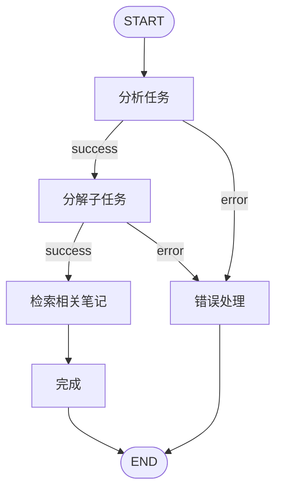

# Agent详细设计 - Personal Growth OS

---

## **1. Agent架构概述**

### **1.1. 设计理念**

本项目采用 **LangGraph StateGraph** 作为核心Agent框架,遵循以下设计原则:

1. **状态驱动** (State-Driven): 使用TypedDict定义清晰的状态模式
2. **节点模块化** (Node-Based): 每个节点是独立的处理单元,纯函数设计
3. **条件路由** (Conditional Routing): 基于状态动态路由,支持复杂工作流
4. **可视化优先** (Visualization-First): 支持Mermaid图自动生成,便于调试和文档化
5. **类型安全** (Type-Safe): 使用TypedDict和Literal类型确保类型安全

### **1.2. 技术栈**

```
langgraph==0.2.45                  # 主力框架
langgraph-checkpoint-sqlite==1.0.3 # 状态持久化
langchain-core==0.3.15             # 仅用于LLM接口
langchain-openai==0.2.8            # OpenAI集成
langchain-anthropic==0.2.4         # Claude集成
```

**关键依赖限制**:
- ✅ 使用 LangGraph 而非 LangChain Chain
- ✅ 只使用 LangChain Core 提供的LLM接口
- ❌ 不使用 LangChain 的 Prompt Template、Output Parser等
- ❌ 不使用 Agno (设计中提到但未实现)

---

## **2. Agent实现清单**

| Agent名称 | 实现状态 | 文件路径 | 用途 |
|-----------|---------|----------|------|
| Task Igniter Agent | ✅ 已实现 | `backend/app/agents/task_igniter_agent.py` | 任务启动仪式,AI任务分解 |
| Review Coach Agent | ❌ 未实现 | - | 复盘教练,引导式对话 |
| Knowledge Retriever Agent | ❌ 未实现 | - | 知识检索和推荐 |

---

## **3. Task Igniter Agent - 任务启动仪式Agent**

### **3.1. Agent职责**

将用户输入的模糊、大任务自动分解为3-5个可执行的子任务,并检索相关历史知识。

**核心功能**:
1. 分析用户输入,提炼主任务标题和描述
2. 将主任务分解为3-5个具体可执行的子任务
3. 识别"最小可行启动任务"(降低行动门槛)
4. 从ChromaDB检索相关历史笔记

### **3.2. 状态定义 (State Schema)**

```python
from typing import TypedDict, Literal, Annotated, List, Dict, Any
from operator import add

class TaskIgniterState(TypedDict):
    """
    Agent的状态定义 - LangGraph的核心
    每个节点都接收这个状态,并返回部分更新
    """
    # 输入
    user_input: str                 # 用户输入的任务描述
    project_id: int | None          # 可选的项目ID

    # 中间状态
    main_task_title: str            # 主任务标题
    main_task_description: str      # 主任务描述
    subtasks: Annotated[List[Dict[str, Any]], add]  # 子任务列表 (使用add reducer累积)
    minimum_viable_task_index: int  # 最小可行启动任务的索引

    # 检索结果
    related_notes: List[Dict[str, Any]]  # 相关笔记列表

    # 控制流
    status: Literal["init", "analyzing", "decomposing", "retrieving", "completed", "error"]
    error_message: str | None       # 错误信息
```

**关键点**:
- 使用 `Annotated[List[Dict], add]` 实现累积reducer,允许多个节点向同一列表添加元素
- `status` 使用 `Literal` 类型限制可能的值
- 所有中间状态字段初始值由首个节点设置

### **3.3. 节点函数 (Nodes)**

#### **3.3.1. analyze_task_node - 分析任务**

**职责**: 分析用户输入,提炼出清晰的主任务标题和描述。

```python
def analyze_task_node(state: TaskIgniterState) -> Dict[str, Any]:
    """
    节点1: 分析用户输入,提炼出主任务的标题和描述
    """
    llm = get_chat_model(temperature=0.7)

    prompt = f"""作为任务规划助手,分析用户的任务描述并提炼出清晰的主任务。

用户输入:{state['user_input']}

请返回JSON格式(不要包含markdown代码块标记):
{{
    "title": "精炼的任务标题(15字以内)",
    "description": "清晰的任务描述(50字以内)"
}}"""

    try:
        response = llm.invoke(prompt)
        # 清理可能的markdown代码块标记
        content = response.content.strip()
        if content.startswith("```"):
            content = content.split("\n", 1)[1]
            content = content.rsplit("```", 1)[0]

        result = json.loads(content)

        return {
            "main_task_title": result["title"],
            "main_task_description": result["description"],
            "status": "analyzing"
        }
    except Exception as e:
        return {
            "status": "error",
            "error_message": f"分析任务失败: {str(e)}"
        }
```

**输入**: `user_input`
**输出**: `main_task_title`, `main_task_description`, `status`
**LLM调用**: 是

#### **3.3.2. decompose_task_node - 分解任务**

**职责**: 将主任务分解为3-5个可执行的子任务,并标识最小可行启动任务。

```python
def decompose_task_node(state: TaskIgniterState) -> Dict[str, Any]:
    """
    节点2: 将主任务分解为3-5个可执行的子任务
    """
    llm = get_chat_model(temperature=0.7)

    prompt = f"""作为任务分解专家,将以下任务分解为3-5个具体可执行的子任务。

主任务:{state['main_task_title']}
描述:{state['main_task_description']}

请返回JSON格式:
{{
    "subtasks": [
        {{
            "title": "子任务标题",
            "description": "具体描述",
            "estimated_minutes": 30
        }}
    ],
    "minimum_viable_index": 0
}}"""

    try:
        response = llm.invoke(prompt)
        content = response.content.strip()
        # 清理markdown
        if content.startswith("```"):
            content = content.split("\n", 1)[1]
            content = content.rsplit("```", 1)[0]

        result = json.loads(content)

        return {
            "subtasks": result["subtasks"],
            "minimum_viable_task_index": result["minimum_viable_index"],
            "status": "decomposing"
        }
    except Exception as e:
        return {
            "status": "error",
            "error_message": f"分解任务失败: {str(e)}"
        }
```

**输入**: `main_task_title`, `main_task_description`
**输出**: `subtasks`, `minimum_viable_task_index`, `status`
**LLM调用**: 是

#### **3.3.3. retrieve_notes_node - 检索相关笔记**

**职责**: 从ChromaDB检索与主任务相关的历史笔记。

```python
def retrieve_notes_node(state: TaskIgniterState) -> Dict[str, Any]:
    """
    节点3: 从知识库检索相关笔记
    """
    try:
        from app.services.vector_store import get_vector_store

        vector_store = get_vector_store()
        query = f"{state['main_task_title']} {state['main_task_description']}"

        # 语义搜索
        results = vector_store.similarity_search(
            query=query,
            k=5,
            filter=None
        )

        related_notes = [
            {
                "id": r.metadata.get("note_id"),
                "title": r.metadata.get("title"),
                "content_snippet": r.page_content[:200],
                "relevance_score": r.metadata.get("score", 0.0)
            }
            for r in results
        ]

        return {
            "related_notes": related_notes,
            "status": "retrieving"
        }
    except Exception as e:
        # 即使检索失败也继续,只是没有相关笔记
        return {
            "related_notes": [],
            "status": "retrieving",
            "error_message": f"检索笔记失败: {str(e)}"
        }
```

**输入**: `main_task_title`, `main_task_description`
**输出**: `related_notes`, `status`
**LLM调用**: 否 (使用向量搜索)

#### **3.3.4. finalize_node - 完成**

**职责**: 标记Agent执行完成。

```python
def finalize_node(state: TaskIgniterState) -> Dict[str, Any]:
    """
    节点4: 完成处理,设置最终状态
    """
    return {
        "status": "completed"
    }
```

**输入**: 所有状态
**输出**: `status`
**LLM调用**: 否

### **3.4. 条件路由 (Conditional Routing)**

```python
def route_after_analyze(state: TaskIgniterState) -> Literal["decompose_task", "error"]:
    """
    analyze_task节点之后的路由决策
    """
    if state["status"] == "error":
        return "error"
    return "decompose_task"

def route_after_decompose(state: TaskIgniterState) -> Literal["retrieve_notes", "error"]:
    """
    decompose_task节点之后的路由决策
    """
    if state["status"] == "error":
        return "error"
    return "retrieve_notes"
```

### **3.5. 图构建 (Graph Construction)**

```python
from langgraph.graph import StateGraph, START, END

def create_task_igniter_graph():
    """
    构建Task Igniter Agent的StateGraph
    """
    # 创建图构建器
    builder = StateGraph(TaskIgniterState)

    # 添加节点
    builder.add_node("analyze_task", analyze_task_node)
    builder.add_node("decompose_task", decompose_task_node)
    builder.add_node("retrieve_notes", retrieve_notes_node)
    builder.add_node("finalize", finalize_node)
    builder.add_node("error", lambda state: {"status": "error"})

    # 添加边
    builder.add_edge(START, "analyze_task")
    builder.add_conditional_edges(
        "analyze_task",
        route_after_analyze,
        {
            "decompose_task": "decompose_task",
            "error": "error"
        }
    )
    builder.add_conditional_edges(
        "decompose_task",
        route_after_decompose,
        {
            "retrieve_notes": "retrieve_notes",
            "error": "error"
        }
    )
    builder.add_edge("retrieve_notes", "finalize")
    builder.add_edge("finalize", END)
    builder.add_edge("error", END)

    # 编译图
    graph = builder.compile()
    return graph
```

### **3.6. Agent执行流程图**



### **3.7. 使用方式**

```python
from app.agents.task_igniter_agent import get_task_igniter

# 获取Agent实例
agent = get_task_igniter()

# 同步执行
result = agent.invoke({
    "user_input": "准备下周的项目演示",
    "project_id": 1
})

# 异步执行
result = await agent.ainvoke({
    "user_input": "写一份年度总结报告",
    "project_id": None
})

# 访问结果
print(f"主任务: {result['main_task_title']}")
print(f"子任务数量: {len(result['subtasks'])}")
print(f"相关笔记: {len(result['related_notes'])}")
```

### **3.8. 可视化支持**

```python
def get_graph_visualization():
    """
    获取Agent的Mermaid可视化图
    用于文档和调试
    """
    graph = create_task_igniter_graph()
    mermaid = graph.get_graph().draw_mermaid()
    return mermaid

# API端点 (临时禁用)
# GET /api/tasks/agent/visualization
```

---

## **4. Agent开发最佳实践**

### **4.1. 状态设计原则**

1. **最小化状态**: 只包含必要的字段
2. **明确类型**: 使用TypedDict和Literal
3. **使用Reducer**: 对累积型数据使用`Annotated[List, add]`
4. **状态不可变**: 节点返回新状态,不修改输入状态

### **4.2. 节点设计原则**

1. **纯函数**: 节点函数应该是纯函数,相同输入产生相同输出
2. **单一职责**: 每个节点只做一件事
3. **错误处理**: 所有节点都应捕获异常并更新status
4. **部分更新**: 节点只返回需要更新的字段

### **4.3. LLM调用最佳实践**

1. **统一接口**: 始终使用`get_chat_model()`而非直接实例化
2. **温度控制**: 创意任务使用0.7-0.9,确定性任务使用0.0-0.3
3. **JSON清理**: 清理LLM返回的markdown代码块标记
4. **容错处理**: 使用try-except捕获JSON解析错误

### **4.4. 测试策略**

```python
def test_analyze_task_node():
    """
    单元测试: 测试analyze_task节点
    """
    state = {
        "user_input": "写一份项目报告",
        "project_id": None
    }

    result = analyze_task_node(state)

    assert result["status"] == "analyzing"
    assert "main_task_title" in result
    assert len(result["main_task_title"]) <= 15
```

---

## **5. 未来Agent扩展计划**

### **5.1. Review Coach Agent (优先级: P1)**

**职责**: 引导用户进行深度复盘,通过开放性问题激发思考。

**关键特性**:
- 分析用户任务完成数据
- 识别模式和异常
- 生成洞察驱动的开放性问题
- 对话式引导,而非直接给结论

**状态定义 (草案)**:
```python
class ReviewCoachState(TypedDict):
    time_period: str                          # 复盘时间段
    task_data: List[Dict]                     # 任务数据
    insights: List[str]                       # 发现的洞察
    questions: List[str]                      # 生成的问题
    conversation_history: List[Dict]          # 对话历史
    status: Literal["analyzing", "questioning", "reflecting", "completed"]
```

### **5.2. Knowledge Retriever Agent (优先级: P2)**

**职责**: 主动检索和推荐相关知识。

**关键特性**:
- 上下文感知的知识检索
- 多源知识融合(笔记 + 对话历史)
- 相关性评分和排序
- 知识摘要生成

---

## **6. 参考资料**

### **6.1. 官方文档**

- [LangGraph官方文档](https://langchain-ai.github.io/langgraph/)
- [LangGraph GitHub](https://github.com/langchain-ai/langgraph)
- [LangChain Core文档](https://python.langchain.com/docs/modules/model_io/)

### **6.2. 项目文档**

- [LANGGRAPH_ARCHITECTURE.md](../LANGGRAPH_ARCHITECTURE.md) - LangGraph架构设计(英文)
- [工程架构.md](工程架构.md) - 技术架构概述
- [后端详细设计.md](后端详细设计.md) - 后端设计文档

---

**文档版本**: v1.0
**最后更新**: 2025-11-03
**维护者**: Claude Code
