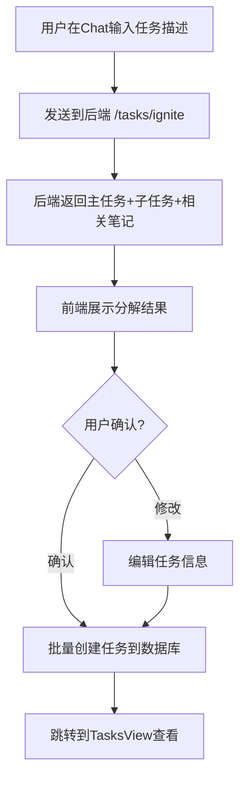
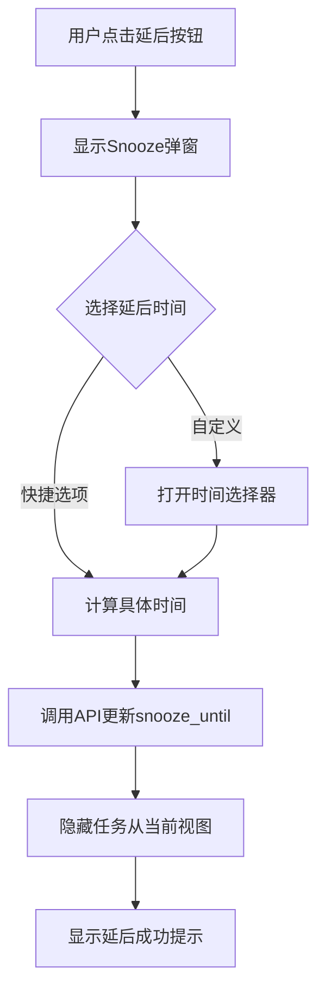
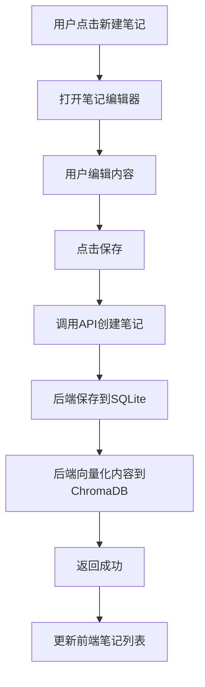

# 项目："个人成长操作系统" (Personal Growth OS) - 前端详细设计文档

---

## **第一部分：前端详细设计 (Frontend Design)**

---

### **1. 前端整体设计 (Frontend Architecture Overview)**

#### **1.1. 核心设计理念**

##### **1.1.1. 组件化 (Component-Based Architecture)**

将UI拆分为可复用、高内聚、低耦合的组件层级：

```
原子组件 (Atomic)
    ↓
分子组件 (Molecular)
    ↓
组织组件 (Organism)
    ↓
页面组件 (Page)
```

**设计原则**：
- 组件应该"纯粹"：相同的props产生相同的渲染结果
- 组件应该"可组合"：大组件由小组件组合而成
- 组件应该"可测试"：独立的组件便于单元测试

---

##### **1.1.2. 状态驱动 (State-Driven UI)**

界面由统一的状态管理器（Pinia）驱动，不直接操作DOM。

**单向数据流**：
```
用户操作 → Action → State更新 → UI自动重新渲染
```

---

##### **1.1.3. 多模态交互 (Multi-Modal Interaction)**

提供两种互补的交互方式：

| 交互方式 | 适合场景 | 优势 |
|---------|---------|------|
| **图形化交互 (GUI)** | 快速浏览、精确操作、批量管理 | 所见即所得，学习曲线平缓 |
| **对话式交互 (Chat)** | 复杂需求、探索性操作、跨模块联动 | 无需记忆操作路径，AI智能理解意图 |

---

##### **1.1.4. 响应式设计 (Responsive Design)**

- **当前阶段**：专注桌面端体验（最小分辨率：1280px × 720px）
- **后续扩展**：为移动端、平板适配预留设计空间

---

#### **1.2. 技术栈说明**

| 技术 | 版本 | 用途 | 选型理由 |
|------|------|------|----------|
| **Vue 3** | 3.4+ | 前端框架 | Composition API适合复杂状态管理，响应式系统成熟 |
| **TypeScript** | 5.3+ | 类型系统 | 提供类型安全，减少运行时错误，提升开发体验 |
| **Vite** | 5.0+ | 构建工具 | 开发服务器快速，HMR体验好，配置简洁 |
| **Pinia** | 2.1+ | 状态管理 | Vue 3官方推荐，API简洁，TypeScript支持好 |
| **Element Plus** | 2.5+ | UI组件库 | 组件丰富，文档完善，支持主题定制 |
| **Vue Router** | 4.2+ | 路由管理 | Vue官方路由，支持动态路由和导航守卫 |
| **Axios** | 1.6+ | HTTP客户端 | 成熟的请求库，支持拦截器和错误处理 |
| **ECharts** | 5.x | 数据可视化 | 用于复盘页面的图表展示，功能强大 |

---

#### **1.3. 整体布局架构 - 三栏设计**

整个应用采用**固定三栏布局**，所有页面共享这一布局框架。

##### **1.3.1. 布局结构**

```
┌────────────┬─────────────────────────────────┬──────────────┐
│            │                                 │              │
│  侧边栏     │      主内容区                    │  AI Chat     │
│  Sidebar   │   Main Content Area            │   Panel      │
│            │                                 │              │
│  180-240px │      (自适应宽度)                │  可调整比例   │
│  可拖拽调整 │                                 │  (拖拽分隔线) │
│            │                                 │  默认 40%    │
└────────────┴─────────────────────────────────┴──────────────┘
```

##### **1.3.2. 各栏职责**

**左侧 - 侧边栏 (Sidebar)**
- **顶部**：应用Logo + 品牌名称
- **导航区**：页面路由导航菜单（Dashboard、任务、笔记、复盘）
- **对话历史区**：紧跟在导航菜单下方
  - 显示历史对话列表（可滚动）
  - 每条记录可自定义标题（默认为用户第一句话，过长显示省略号）
  - 支持点击切换对话
- **底部固定**：新建对话按钮（固定在底部，不参与滚动）
- **功能**：导航切换、对话历史管理、可折叠/展开
- **图标**：统一使用 @element-plus/icons-vue

**中间 - 主内容区 (Main Content Area)**
- 根据当前路由显示不同页面内容
- Dashboard → 周日历 + 课程表任务视图
- TasksView → 任务管理器（看板/列表/项目树）
- NotesView → 笔记卡片网格
- ReviewView → 复盘仪表盘
- 宽度自适应，与Chat Panel比例可调

**右侧 - AI Chat面板 (AI Chat Panel)**
- **可调整宽度**：与主内容区通过拖拽分隔线调整占比
- **默认宽度**：占主内容区域（Main + Chat）的 40%
- **最小宽度**：350px，确保对话内容可读性
- **最大宽度**：占比不超过 60%，保证主内容区有足够空间
- **上下文感知**：根据当前页面自动调整对话内容
- **QQ风格**：消息气泡、时间戳、操作按钮
- **功能**：创建任务/笔记、查询信息、执行复杂操作、跨页面联动

##### **1.3.3. 响应式宽度配置**

| 区域 | 默认宽度 | 最小宽度 | 最大宽度 | 可调整 |
|------|---------|---------|---------|--------|
| Sidebar | 200px | 180px | 240px | 可拖拽调整宽度 |
| Chat Panel | 40% (相对于Main+Chat总宽) | 350px | 60% | 可拖拽分隔线调整占比 |
| Main Content | 60% (相对于Main+Chat总宽) | 600px | - | 自适应 |

**最小总宽度**：180 + 600 + 350 = 1130px（推荐1440px+）

**新建对话按钮**：固定在Sidebar底部，不随对话历史滚动

---

#### **1.4. 目录与文件组织结构**

```
frontend/
├── src/
│   ├── api/                      # API服务封装
│   │   ├── request.ts           # Axios封装和拦截器
│   │   ├── taskService.ts
│   │   ├── noteService.ts
│   │   ├── chatService.ts
│   │   └── reviewService.ts
│   │
│   ├── assets/                   # 静态资源
│   │   └── styles/              # 全局样式
│   │       ├── variables.scss   # CSS变量
│   │       ├── mixins.scss      # SCSS混入
│   │       └── global.scss
│   │
│   ├── components/               # 可复用组件
│   │   ├── common/              # 通用基础组件
│   │   ├── layout/              # 布局组件
│   │   ├── chat/                # 聊天相关组件
│   │   ├── task/                # 任务相关组件
│   │   ├── calendar/            # 日历相关组件
│   │   ├── note/                # 笔记相关组件
│   │   └── review/              # 复盘相关组件
│   │
│   ├── layouts/                  # 页面布局
│   │   └── MainLayout.vue       # 主布局（三栏结构）
│   │
│   ├── views/                    # 页面级组件（路由）
│   │   ├── DashboardView.vue
│   │   ├── TasksView.vue
│   │   ├── NotesView.vue
│   │   └── ReviewView.vue
│   │
│   ├── stores/                   # Pinia状态管理
│   │   ├── taskStore.ts
│   │   ├── noteStore.ts
│   │   ├── chatStore.ts
│   │   ├── uiStore.ts
│   │   └── reviewStore.ts
│   │
│   ├── router/                   # 路由配置
│   │   └── index.ts
│   │
│   ├── types/                    # TypeScript类型定义
│   │   ├── task.ts
│   │   ├── note.ts
│   │   ├── chat.ts
│   │   └── common.ts
│   │
│   ├── utils/                    # 工具函数
│   │   ├── dateFormat.ts
│   │   ├── storage.ts
│   │   └── validators.ts
│   │
│   ├── App.vue
│   └── main.ts
│
├── vite.config.ts
├── tsconfig.json
└── package.json
```

---

### **2. 页面设计 (Page Designs)**

#### **2.1. MainLayout - 主布局容器**

MainLayout是所有页面的容器，实现三栏布局框架。

##### **2.1.1. 组件Props**

```typescript
// MainLayout不接收外部Props，直接使用全局Store
```

##### **2.1.2. 布局结构**

```
┌──────────┬─────────────────────┬──────────┐
│ Sidebar  │   Main Content      │ ChatPanel│
│          │   <router-view>     │          │
└──────────┴─────────────────────┴──────────┘
```

---

#### **2.2. Sidebar - 侧边栏组件**

##### **2.2.1. 组件Props**

```typescript
interface SidebarProps {
  collapsed: boolean;        // 是否折叠
  width: number;             // 宽度（px）
}

interface SidebarEmits {
  'update:width': (width: number) => void;
  'toggle-collapse': () => void;
}
```

##### **2.2.2. 视觉设计**

```
┌──────────────────┐
│                  │
│    [Logo Icon]   │
│  Personal Growth │
│       OS         │
│                  │
├──────────────────┤
│                  │
│  🏠 工作台  ✓    │  ← 当前页面高亮
│  📋 任务         │
│  📝 笔记         │
│  📊 复盘         │
│                  │
├──────────────────┤
│   [留白空间]     │
├──────────────────┤
│  💬 对话记录     │
│  ──────────────  │
│  ┌────────────┐ │
│  │ 🤖 AI      │ │
│  │ 今天的任务 │ │
│  │ 5分钟前    │ │
│  └────────────┘ │
│  [滚动...]     │
│  [+ 新建对话]   │
└──────────────────┘
   ↕️ 可拖拽调整宽度
```

##### **2.2.3. 对话历史列表数据结构**

```typescript
interface Conversation {
  id: string;
  title: string;           // AI自动生成或用户命名
  lastMessage: string;     // 最后一条消息预览
  timestamp: Date;         // 最后更新时间
  isActive: boolean;       // 是否为当前激活对话
  context: 'dashboard' | 'task' | 'note' | 'review';
}
```

---

#### **2.3. Dashboard - 工作台（时间视角）**

Dashboard提供"本周要做什么"的时间视角。

##### **2.3.1. 页面布局**

```
┌─────────────────────────────────────────────────────────┐
│  📊 今日概览                         2025年11月 第45周  │
│  ─────────────────────────────────────────────────────  │
│  ┌─────────┐  ┌─────────┐  ┌─────────┐  ┌─────────┐   │
│  │📌 待办  │  │⚠️ 逾期 │  │✅ 完成  │  │📅 本周  │   │
│  │   3     │  │   1     │  │   12    │  │   18    │   │
│  └─────────┘  └─────────┘  └─────────┘  └─────────┘   │
│                                                         │
│  📅 本周课程表视图                                      │
│  ─────────────────────────────────────────────────────  │
│      周一  周二  周三  周四  周五  周六  周日            │
│  8:00 [任务][任务]            [任务]                    │
│  9:00      [任务][任务]                                │
│ 10:00           [任务]                                 │
│  ...                                                    │
│                                                         │
│  📋 今日无时间任务（拖拽到日历可指定时间）              │
│  ☐ 阅读产品需求文档              [⏰ 延后]             │
│  ☐ 回复客户邮件                  [⏰ 延后]             │
└─────────────────────────────────────────────────────────┘
```

##### **2.3.2. 核心组件**

- **StatisticsCards** - 统计卡片
- **WeekCalendarView** - 周日历课程表
  - **AllDayTaskCard** - 单个全天任务（带Popover详情）
  - **AllDayAggregation** - 多个全天任务聚合（灰色背景+徽章）
  - **TaskCard** - 时间轴单任务卡片
  - **AggregationBlock** - 时间轴聚合块
- **FloatingTaskList** - 无时间任务列表

##### **2.3.3. WeekCalendar数据结构**

```typescript
interface WeekCalendarProps {
  tasks: Task[];                    // 本周任务列表
}

interface WeekDay {
  name: string;                     // 周一、周二...
  date: Date;                       // 日期
  tasks: Task[];                    // 当天有时间的任务
}

interface Task {
  id: string;
  title: string;
  status: 'pending' | 'in_progress' | 'completed' | 'overdue';  // 任务状态
  startTime?: Date;                 // 开始时间（必填）
  endTime?: Date;                   // 结束时间（可选）
  duration?: number;                // 持续时间（分钟）- 从endTime-startTime计算
  priority: number;                 // 优先级 1-5
  completed: boolean;
  snoozeUntil?: Date;               // 延后到何时
  project?: {
    id: string;
    name: string;
    color: string;
  };
}
```

**课程表配置**：
- 时间范围：8:00 - 21:00（14小时）
- 时间槽：每小时一行（60px高度）
- 列数：8列（时间列 + 7天）
- 任务高度：根据duration动态计算
- 优先级颜色：
  - 高优先级（4-5）：红色边框
  - 中优先级（2-3）：黄色边框
  - 低优先级（0-1）：蓝色边框

**功能特性**：
- 周导航：上一周/下一周/回到今天
- 今日高亮：今天的日期圆形高亮显示
- 时间槽点击：点击空白时间槽可快速创建任务
- 任务点击：点击任务查看/编辑详情
- 无时间任务：显示在底部拖拽区，可拖拽到日历指定时间
- 悬停效果：任务卡片悬停时阴影加深并上移

---

#### **2.4. TasksView - 任务管理器（全局视角）**

TasksView提供"有什么任务"的全局视角。

##### **2.4.1. 页面布局**

```
┌─────────────────────────────────────────────────────────┐
│  📋 任务管理                                             │
│  ─────────────────────────────────────────────────────  │
│  [项目筛选▼] [状态筛选▼] [标签筛选▼]  [🔍 搜索]        │
│                                                         │
│  [📊 看板] [📝 列表] [🌳 项目树]  ← 视图切换             │
│  ─────────────────────────────────────────────────────  │
│                                                         │
│  【看板视图示例】                                        │
│  ┌──────────┐ ┌──────────┐ ┌──────────┐               │
│  │  待办     │ │ 进行中   │ │  已结束  │               │
│  ├──────────┤ ├──────────┤ ├──────────┤               │
│  │ [任务卡] │ │ [任务卡] │ │ [任务卡] │               │
│  │ [任务卡] │ │ [任务卡] │ │ [任务卡] │               │
│  │ [任务卡] │ │          │ │ [任务卡] │               │
│  └──────────┘ └──────────┘ └──────────┘               │
│                              (含已完成&逾期)            │
│                                                         │
│  [+ 新建任务]                                           │
└─────────────────────────────────────────────────────────┘
```

##### **2.4.2. 三种视图模式**

| 视图模式 | 适用场景 | 特点 |
|---------|---------|------|
| **看板视图** | 按状态管理任务 | 三栏布局：待办/进行中/已结束（含已完成和逾期） |
| **列表视图** | 快速浏览所有任务 | 紧凑显示，支持快速筛选排序 |
| **项目树视图** | 按项目层级管理 | 树形结构，展示项目-任务层级 |

##### **2.4.3. TaskCard组件Props**

```typescript
interface TaskCardProps {
  task: Task;
  variant?: 'default' | 'compact' | 'calendar';  // 三种变体
  draggable?: boolean;                           // 是否可拖拽
  showActions?: boolean;                         // 是否显示操作按钮
}

interface TaskCardEmits {
  'click': (task: Task) => void;
  'edit': (task: Task) => void;
  'delete': (taskId: string) => void;
  'snooze': (taskId: string) => void;
  'complete': (taskId: string) => void;
}
```

---

#### **2.5. NotesView - 知识库**

##### **2.5.1. 页面布局**

```
┌─────────────────────────────────────────────────────────┐
│  📝 知识库                                               │
│  ─────────────────────────────────────────────────────  │
│  [标签筛选▼] [排序▼]  [🔍 搜索]         [+ 新建笔记]   │
│  ─────────────────────────────────────────────────────  │
│                                                         │
│  【卡片网格视图】                                        │
│  ┌────────────┐ ┌────────────┐ ┌────────────┐         │
│  │ 笔记标题1  │ │ 笔记标题2  │ │ 笔记标题3  │         │
│  │            │ │            │ │            │         │
│  │ 内容预览.. │ │ 内容预览.. │ │ 内容预览.. │         │
│  │            │ │            │ │            │         │
│  │ #标签1     │ │ #标签2     │ │ #标签3     │         │
│  │ 2天前      │ │ 1周前      │ │ 1个月前    │         │
│  └────────────┘ └────────────┘ └────────────┘         │
│  ┌────────────┐ ┌────────────┐ ┌────────────┐         │
│  │ 笔记标题4  │ │ 笔记标题5  │ │ 笔记标题6  │         │
│  └────────────┘ └────────────┘ └────────────┘         │
└─────────────────────────────────────────────────────────┘
```

##### **2.5.2. NoteCard组件Props**

```typescript
interface NoteCardProps {
  note: Note;
  variant?: 'default' | 'expanded';  // 默认/展开
}

interface NoteCardEmits {
  'click': (note: Note) => void;
  'edit': (note: Note) => void;
  'delete': (noteId: string) => void;
}
```

**卡片网格布局**：
- 列数：自适应（min-width: 280px）
- 间距：24px
- 卡片高度：自适应内容（max-height: 300px）

---

#### **2.6. ReviewView - 复盘仪表盘**

##### **2.6.1. 页面布局**

```
┌─────────────────────────────────────────────────────────┐
│  📊 复盘仪表盘                                           │
│  ─────────────────────────────────────────────────────  │
│  [周报告▼] [月报告▼] [自定义▼]       [📅 2025-11-01]   │
│  ─────────────────────────────────────────────────────  │
│                                                         │
│  【数据洞察模块】                                        │
│  ┌─────────────────────┐ ┌─────────────────────┐       │
│  │ 📈 任务完成趋势      │ │ ⏱️ 拖延分析         │       │
│  │ [折线图]            │ │ [饼图]              │       │
│  └─────────────────────┘ └─────────────────────┘       │
│  ┌─────────────────────┐ ┌─────────────────────┐       │
│  │ 📚 知识增长         │ │ 🎯 优先级分布       │       │
│  │ [柱状图]            │ │ [雷达图]            │       │
│  └─────────────────────┘ └─────────────────────┘       │
│                                                         │
│  【AI洞察】                                             │
│  💡 这周你在周四的完成率最高，建议将重要任务安排在周四  │
│  💡 "技术学习"类任务经常被延后，可能需要调整计划        │
│                                                         │
│  [🤖 开始AI引导复盘对话]                                │
└─────────────────────────────────────────────────────────┘
```

##### **2.6.2. 数据模块类型**

```typescript
interface ReviewDataModule {
  id: string;
  type: 'chart' | 'insight' | 'table';
  title: string;
  data: any;                          // 图表数据
  interactive: boolean;               // 是否可交互
}

// 图表配置
interface ChartConfig {
  type: 'line' | 'bar' | 'pie' | 'radar';
  xAxis?: string[];
  yAxis?: number[];
  series: any[];
}
```

---

### **3. 核心组件设计 (Component Specifications)**

#### **3.1. ChatPanel - AI聊天面板**

##### **3.1.1. 组件Props**

```typescript
interface ChatPanelProps {
  width: number;                      // 面板宽度
}
```

##### **3.1.2. 消息数据结构**

```typescript
interface Message {
  id: string;
  role: 'user' | 'assistant';
  content: string;
  timestamp: Date;
  actions?: MessageAction[];          // AI消息的操作按钮
  metadata?: {
    relatedTasks?: string[];          // 相关任务ID
    relatedNotes?: string[];          // 相关笔记ID
    confidence?: number;              // 置信度
  };
}

interface MessageAction {
  type: 'create_task' | 'create_note' | 'navigate' | 'search';
  label: string;                      // 按钮文本
  payload: any;                       // 操作数据
}
```

##### **3.1.3. QQ风格设计**

```
┌─────────────────────────────┐
│  💬 对话                     │
│  ───────────────────────────│
│                             │
│  ┌─────────────────┐        │  ← 用户消息（右对齐）
│  │ 帮我创建一个任务 │        │
│  │ 10:30           │        │
│  └─────────────────┘        │
│                             │
│        ┌───────────────────┐│  ← AI消息（左对齐）
│        │ 好的，请告诉我：  ││
│        │ 1. 任务标题      ││
│        │ 2. 截止时间      ││
│        │ 10:31           ││
│        │ [创建] [取消]    ││  ← 操作按钮
│        └───────────────────┘│
│                             │
│  ───────────────────────────│
│  [输入消息...] [发送]       │
└─────────────────────────────┘
```

---

#### **3.2. AllDayTaskCard - 单个全天任务卡片**

##### **3.2.1. 组件Props**

```typescript
interface AllDayTaskCardProps {
  task: Task;                         // 任务对象
}

interface AllDayTaskCardEmits {
  'task-click': (task: Task) => void; // 点击任务事件
}
```

##### **3.2.2. 组件特性**

- **位置**: 8:00时间线上方的全天事件区域
- **高度**: 固定20px
- **样式**:
  - 药丸形状（border-radius: 4px）
  - 优先级背景色（高=红色、中=蓝色、低=绿色）
  - 白色文字
- **显示内容**: 仅任务标题（超出省略）
- **交互**:
  - Hover触发Popover（placement: bottom, width: 250px）
  - Popover显示完整详情：标题、开始/结束时间、优先级、项目
  - 点击触发task-click事件

##### **3.2.3. Popover内容结构**

```typescript
// 显示字段
- 标题 (title)
- 开始时间 (startTime: YYYY-MM-DD HH:mm)
- 结束时间 (endTime: YYYY-MM-DD HH:mm)
- 优先级 (priority: "高" | "中" | "低")
- 项目 (project: 带颜色点 + 项目名称)
```

---

#### **3.3. AllDayAggregation - 全天任务聚合块**

##### **3.3.1. 组件Props**

```typescript
interface AllDayAggregationProps {
  tasks: Task[];                      // 所有全天任务（≥2个）
}

interface AllDayAggregationEmits {
  'task-click': (task: Task) => void; // 点击列表中某个任务
}
```

##### **3.3.2. 组件特性**

- **样式**:
  - 灰色背景 (#e5e7eb)，类似重叠任务聚合块
  - 高度20px，占满全天事件区域
  - 右侧显示徽章 `+N` (N为任务数量)
- **显示内容**:
  - 所有任务标题用"、"分隔（超出省略）
- **交互**:
  - Hover徽章触发Popover（placement: bottom, width: 300px）
  - Popover列出所有全天任务，按优先级降序排列
  - 每个任务可点击触发task-click事件

##### **3.3.3. Popover任务列表**

```typescript
// 列表头部
header: "全天任务 (N)"

// 每个任务项显示
- 时间范围 (跨天显示完整日期+时间)
- 任务标题
- 优先级颜色条（左侧3px border）
- 项目信息（带颜色点）

// 排序规则
1. 按优先级降序 (priority: 5→1)
2. 同优先级按开始时间升序
```

---

#### **3.4. TaskSnoozePopover - 延后任务弹窗**

##### **3.4.1. 组件Props**

```typescript
interface TaskSnoozePopoverProps {
  visible: boolean;
  taskId: string;
}

interface TaskSnoozePopoverEmits {
  'confirm': (taskId: string, snoozeUntil: Date) => void;
  'cancel': () => void;
}
```

##### **3.4.2. 快捷选项**

| 选项 | 延后时间 |
|------|---------|
| 1小时后 | +1 hour |
| 今天下午 | 今天 18:00 |
| 明天早上 | 明天 09:00 |
| 本周末 | 本周六 09:00 |
| 下周一 | 下周一 09:00 |
| 自定义 | 日期时间选择器 |

---

### **4. 交互流程设计 (Interaction Flows)**

#### **4.1. 任务启动仪式流程**



**关键步骤**：
1. 用户在Chat输入："准备下周的项目演示"
2. 前端调用`taskService.ignite(description)`
3. 后端返回JSON（主任务+子任务列表+相关笔记）
4. 前端展示确认对话框
5. 用户确认后批量创建任务
6. 自动跳转到任务页面

---

#### **4.2. 任务延后流程**



---

#### **4.3. 笔记创建流程**



**关键点**：
- 笔记保存时需要同时更新SQLite和ChromaDB
- 支持实时保存（防止数据丢失）
- 支持Markdown编辑

---

### **5. 状态管理设计 (Pinia Stores)**

#### **5.1. taskStore**

```typescript
interface TaskState {
  tasks: Task[];
  loading: boolean;
  filter: TaskFilter | null;
  viewMode: 'kanban' | 'list' | 'project';
}

interface TaskStore {
  // State
  state: TaskState;

  // Getters
  todayTasks: Task[];
  overdueTasks: Task[];
  weekScheduledTasks: Task[];          // 本周有时间的任务
  floatingTasks: Task[];               // 无时间任务

  // Actions
  fetchTasks(): Promise<void>;
  createTask(task: TaskCreate): Promise<Task>;
  updateTask(id: string, update: TaskUpdate): Promise<Task>;
  deleteTask(id: string): Promise<void>;
  snoozeTask(id: string, snoozeUntil: Date): Promise<void>;
  completeTask(id: string): Promise<void>;
}
```

---

#### **5.2. noteStore**

```typescript
interface NoteState {
  notes: Note[];
  loading: boolean;
  filter: NoteFilter | null;
}

interface NoteStore {
  // State
  state: NoteState;

  // Getters
  filteredNotes: Note[];
  notesByTag: Map<string, Note[]>;

  // Actions
  fetchNotes(): Promise<void>;
  createNote(note: NoteCreate): Promise<Note>;
  updateNote(id: string, update: NoteUpdate): Promise<Note>;
  deleteNote(id: string): Promise<void>;
  searchNotes(query: string): Promise<Note[]>;  // 语义搜索
}
```

---

#### **5.3. chatStore**

```typescript
interface ChatState {
  conversations: Conversation[];
  currentConversationId: string | null;
  messages: Message[];
  loading: boolean;
}

interface ChatStore {
  // State
  state: ChatState;

  // Getters
  currentConversation: Conversation | null;
  currentMessages: Message[];

  // Actions
  fetchConversations(): Promise<void>;
  createConversation(): Promise<Conversation>;
  sendMessage(content: string): Promise<Message>;
  switchConversation(id: string): Promise<void>;
}
```

---

#### **5.4. uiStore**

```typescript
interface UIState {
  sidebarCollapsed: boolean;
  sidebarWidth: number;
  theme: 'light' | 'dark';
}

interface UIStore {
  // State
  state: UIState;

  // Actions
  toggleSidebar(): void;
  setSidebarWidth(width: number): void;
  setTheme(theme: 'light' | 'dark'): void;
}
```

---

### **6. 路由配置 (Vue Router)**

```typescript
const routes: RouteRecordRaw[] = [
  {
    path: '/',
    component: MainLayout,
    redirect: '/dashboard',
    children: [
      {
        path: '/dashboard',
        name: 'Dashboard',
        component: DashboardView,
        meta: { title: '工作台' }
      },
      {
        path: '/tasks',
        name: 'TasksView',
        component: TasksView,
        meta: { title: '任务' }
      },
      {
        path: '/notes',
        name: 'NotesView',
        component: NotesView,
        meta: { title: '笔记' }
      },
      {
        path: '/review',
        name: 'ReviewView',
        component: ReviewView,
        meta: { title: '复盘' }
      }
    ]
  }
];
```

**导航守卫**：
- 页面切换时更新文档标题
- 记录页面访问历史
- 未来扩展：权限验证

---

### **7. API调用与数据流 (API Service Layer)**

#### **7.1. Axios封装**

```typescript
// request.ts
const request = axios.create({
  baseURL: import.meta.env.VITE_API_BASE_URL || 'http://localhost:8000/api',
  timeout: 10000
});

// 请求拦截器
request.interceptors.request.use(
  config => {
    // 添加token等
    return config;
  },
  error => Promise.reject(error)
);

// 响应拦截器
request.interceptors.response.use(
  response => response.data,
  error => {
    // 统一错误处理
    ElMessage.error(error.message);
    return Promise.reject(error);
  }
);
```

---

#### **7.2. taskService**

```typescript
export const taskService = {
  // 获取任务列表
  getTasks(params?: TaskQueryParams): Promise<Task[]> {
    return request.get('/tasks', { params });
  },

  // 创建任务
  createTask(data: TaskCreate): Promise<Task> {
    return request.post('/tasks', data);
  },

  // 任务启动仪式
  ignite(description: string, projectId?: string): Promise<{
    mainTask: Partial<Task>;
    subtasks: Partial<Task>[];
    relatedNotes: any[];
  }> {
    return request.post('/tasks/ignite', { description, projectId });
  },

  // 延后任务
  snooze(id: string, snoozeUntil: Date): Promise<Task> {
    return request.post(`/tasks/${id}/snooze`, { snoozeUntil });
  },

  // 完成任务
  complete(id: string): Promise<Task> {
    return request.post(`/tasks/${id}/complete`);
  }
};
```

---

#### **7.3. 乐观更新策略**

为了提升用户体验，关键操作采用乐观更新：

```typescript
// 示例：完成任务
async function completeTask(taskId: string) {
  // 1. 立即更新UI（乐观更新）
  const task = tasks.value.find(t => t.id === taskId);
  if (task) {
    task.status = 'completed';
    task.completedAt = new Date();
  }

  try {
    // 2. 调用API
    await taskService.complete(taskId);
  } catch (error) {
    // 3. 失败则回滚
    if (task) {
      task.status = 'pending';
      task.completedAt = null;
    }
    ElMessage.error('操作失败');
  }
}
```

---

### **8. UI设计规范 (Design System)**

#### **8.1. 色彩系统**

**主题色 - 蓝色系**

| 变量名 | 颜色值 | 用途 |
|--------|--------|------|
| `--color-primary` | #667eea | 主色，按钮、高亮 |
| `--color-primary-light` | #a8b5f5 | 主色浅色，悬停状态 |
| `--color-primary-dark` | #5568d3 | 主色深色，激活状态 |
| `--color-primary-gradient` | linear-gradient(135deg, #667eea 0%, #764ba2 100%) | 渐变色 |

**功能色**

| 变量名 | 颜色值 | 用途 |
|--------|--------|------|
| `--color-success` | #67c23a | 成功状态 |
| `--color-warning` | #e6a23c | 警告状态 |
| `--color-danger` | #f56c6c | 危险/删除 |
| `--color-info` | #909399 | 信息提示 |

**中性色**

| 变量名 | 颜色值 | 用途 |
|--------|--------|------|
| `--color-text-primary` | #303133 | 主要文本 |
| `--color-text-regular` | #606266 | 常规文本 |
| `--color-text-secondary` | #909399 | 次要文本 |
| `--color-border` | #dcdfe6 | 边框 |
| `--bg-color-page` | #f5f7fa | 页面背景 |
| `--bg-color-card` | #ffffff | 卡片背景 |

---

#### **8.2. 圆角系统**

| 变量名 | 数值 | 用途 |
|--------|------|------|
| `--radius-sm` | 6px | 按钮、输入框 |
| `--radius-md` | 8px | 卡片 |
| `--radius-lg` | 12px | 大卡片、弹窗 |
| `--radius-xl` | 16px | 特殊圆角 |

---

#### **8.3. 间距系统（宽松设计）**

| 变量名 | 数值 | 用途 |
|--------|------|------|
| `--spacing-xs` | 4px | 最小间距 |
| `--spacing-sm` | 8px | 小间距 |
| `--spacing-md` | 16px | 组件内部间距 |
| `--spacing-lg` | 24px | 组件之间间距 |
| `--spacing-xl` | 32px | 区块之间间距 |
| `--spacing-xxl` | 48px | 大区块间距 |

---

#### **8.4. 字体系统**

| 变量名 | 数值 | 用途 |
|--------|------|------|
| `--font-size-xs` | 12px | 辅助文本 |
| `--font-size-sm` | 14px | 正文 |
| `--font-size-md` | 16px | 标题 |
| `--font-size-lg` | 18px | 大标题 |
| `--font-size-xl` | 20px | 页面标题 |
| `--font-size-xxl` | 24px | 特大标题 |

**字体族**：
```css
--font-family: -apple-system, BlinkMacSystemFont, 'Segoe UI', 'PingFang SC',
               'Microsoft YaHei', sans-serif;
```

---

#### **8.5. 阴影系统**

```scss
--shadow-sm: 0 2px 4px rgba(0, 0, 0, 0.08);
--shadow-md: 0 4px 8px rgba(0, 0, 0, 0.12);
--shadow-lg: 0 8px 16px rgba(0, 0, 0, 0.15);
```

---

### **9. 响应式布局策略**

#### **9.1. 断点定义**

| 断点 | 宽度 | 说明 |
|------|------|------|
| `xs` | < 768px | 移动端（未来） |
| `sm` | 768px - 1024px | 平板（未来） |
| `md` | 1024px - 1280px | 小屏桌面 |
| `lg` | 1280px - 1920px | 标准桌面（主要） |
| `xl` | > 1920px | 大屏 |

**MVP阶段最小支持**：1280px

---

#### **9.2. 三栏布局响应式策略**

```scss
// 1280px - 1440px
.main-layout {
  .sidebar {
    width: 200px;
  }
  .chat-panel {
    width: 400px;
  }
  .main-content {
    // 自适应：1280 - 200 - 400 = 680px
  }
}

// 1440px+（推荐）
@media (min-width: 1440px) {
  .sidebar {
    width: 240px;
  }
  .chat-panel {
    width: 450px;
  }
  .main-content {
    // 自适应：1440 - 240 - 450 = 750px+
  }
}
```

---

### **10. 动画与过渡效果**

#### **10.1. 页面切换动画**

```scss
.fade-enter-active,
.fade-leave-active {
  transition: opacity 0.2s ease;
}

.fade-enter-from,
.fade-leave-to {
  opacity: 0;
}
```

---

#### **10.2. 卡片悬停效果**

```scss
.task-card,
.note-card {
  transition: all 0.2s ease;

  &:hover {
    transform: translateY(-2px);
    box-shadow: var(--shadow-lg);
  }
}
```

---

#### **10.3. 列表动画**

```vue
<TransitionGroup name="list" tag="div">
  <TaskCard v-for="task in tasks" :key="task.id" />
</TransitionGroup>
```

```scss
.list-move,
.list-enter-active,
.list-leave-active {
  transition: all 0.3s ease;
}

.list-enter-from {
  opacity: 0;
  transform: translateX(30px);
}

.list-leave-to {
  opacity: 0;
  transform: translateX(-30px);
}
```

---

### **11. 开发优先级与实施建议**

#### **11.1. P0（MVP核心）** ✅ 已完成

1. ✅ **MainLayout + Sidebar + ChatPanel基础布局**
   - 三栏自适应布局，支持拖拽调整比例
   - Sidebar可折叠，支持对话历史管理
   - Chat Panel与Main Content比例可调（默认40%）

2. ✅ **DashboardView骨架（统计卡片 + 悬浮任务）**
   - 四个统计卡片（待办/逾期/完成/本周总计）
   - 悬浮任务列表（已延后任务）
   - 最近动态列表

3. ✅ **TasksView看板视图**
   - Kanban看板视图（待办/进行中/已完成）
   - List列表视图切换
   - 项目/优先级筛选
   - 语义搜索

4. ✅ **TaskCard组件（三种变体）**
   - Default变体（Kanban）
   - Compact变体（列表）
   - Dashboard变体（悬浮任务）

5. ✅ **taskStore + uiStore + chatStore + noteStore**
   - 完整的Pinia状态管理
   - CRUD操作封装
   - 乐观更新模式

6. ✅ **路由配置**
   - Vue Router 配置
   - 四个主页面路由

7. ✅ **对话历史管理**
   - 对话列表显示
   - 历史消息加载
   - 对话标题编辑
   - 对话删除功能
   - 新建对话按钮固定底部

#### **11.2. P1（重要功能）** ✅ 已完成

8. ✅ **WeekCalendar课程表视图**
   - 周视图日历（周一至周日）
   - 时间槽显示（8:00-21:00）
   - 任务时间块渲染
   - 优先级颜色标识
   - 无时间任务拖拽区
   - 周导航（上一周/下一周/今天）

9. ✅ **ChatPanel完整实现**
   - AI对话历史显示
   - 消息操作按钮（创建任务/笔记等）
   - 输入框即时清空
   - 自动滚动到底部

10. ✅ **Task Snooze功能**
    - 延后选项（1小时/3小时/明天/后天/下周一）
    - 自定义时间选择
    - 延后任务隐藏
    - 延后时间到达提醒

11. ✅ **NotesView增强**
    - 语义搜索功能
    - 标签筛选（多选）
    - 排序功能（最新/最早/标题）
    - 网格/列表视图切换
    - 笔记CRUD操作
    - 相似度评分显示

12. ✅ **NoteCard组件**
    - 笔记卡片显示
    - 标签显示
    - 相似度徽章
    - 悬停效果

#### **11.3. P2（增强功能）** ✅ 已完成

13. ✅ **任务项目树视图**
    - 按项目分组显示任务
    - 项目展开/折叠
    - 项目统计（待办/进行中/已完成）
    - 无项目任务分组
    - 任务操作（完成/延后/编辑/删除）

14. ✅ **任务三视图切换**
    - 看板视图（按状态）
    - 列表视图（表格）
    - 项目树视图（按项目）
    - 视图切换按钮组

15. ✅ **笔记 Markdown 编辑器**
    - 集成 md-editor-v3
    - 实时预览
    - 工具栏（加粗/斜体/代码/链接/图片等）
    - 全屏编辑模式
    - Markdown 渲染预览

16. ✅ **ReviewView 数据可视化仪表盘**
    - 4个汇总卡片（已完成任务/完成率/新增笔记/专注时长）
    - 6个 ECharts 图表：
      - 任务完成趋势（折线/柱状可切换）
      - 优先级分布（环形图）
      - 拖延分析（横向柱状图）
      - 知识增长路径（堆叠面积图）
      - 时间分布（饼图）
      - 项目进度（进度条柱状图）
    - 智能洞察卡片（4个）
    - 周期选择（周/月/季/年）
    - 响应式图表（自适应窗口大小）

17. ✅ **键盘快捷键支持**
    - Ctrl/Cmd + 1-4: 页面导航
    - Ctrl/Cmd + K: 快速创建任务
    - Ctrl/Cmd + N: 创建笔记
    - Ctrl/Cmd + /: 切换侧边栏
    - ?: 显示快捷键帮助
    - 快捷键帮助对话框

#### **11.4. P3（优化）** ⏭️ 暂未实现

18. **拖拽排序** (跳过 - 复杂度较高，非必需)
19. **暗色主题切换** (跳过 - P3可选功能)
20. **单元测试** (后续补充)

---

## **总结与要点**

### **核心设计决策**

1. **三栏固定布局** - Sidebar + Main Content + ChatPanel，所有页面共享
2. **双视角设计** - Dashboard（时间视角）+ TasksView（全局视角）
3. **多模态交互** - GUI + Chat互补，用户自由选择
4. **状态驱动UI** - Pinia统一管理状态，单向数据流
5. **组件化设计** - 原子→分子→组织→页面四级组件体系
6. **蓝色圆润浅色调** - #667eea主色，12px圆角，24px宽松间距
7. **乐观更新** - 关键操作立即更新UI，提升响应速度

### **技术特点**

- Vue 3 Composition API
- TypeScript类型安全
- Pinia状态管理
- Element Plus组件库
- ECharts数据可视化
- Axios拦截器统一处理
- 最小支持1280px桌面端

