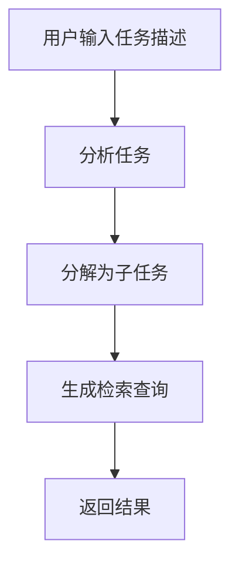

# 项目："个人成长操作系统" (Personal Growth OS) - 后端详细设计文档

---

## **第一部分：后端详细设计 (Backend Design)**

---

### **1. 后端整体设计 (Backend Architecture Overview)**

#### **1.1. 核心设计理念**

##### **1.1.1. 三层架构 (Three-Layer Architecture)**

后端采用经典的三层架构设计，确保职责清晰、易于维护和测试：

```
┌─────────────────────────────────────────────────┐
│                  API Layer                      │
│          (请求处理、参数验证、响应序列化)          │
└──────────────────┬──────────────────────────────┘
                   │
                   ▼
┌─────────────────────────────────────────────────┐
│               Service Layer                     │
│        (核心业务逻辑、复杂流程编排)               │
└──────────────────┬──────────────────────────────┘
                   │
                   ▼
┌─────────────────────────────────────────────────┐
│           Data Access Layer (CRUD)              │
│         (数据库操作抽象、CRUD封装)                │
└─────────────────────────────────────────────────┘
```

**设计原则**：
- **API层应该"薄"**：只负责HTTP协议相关的处理
- **服务层应该"厚"**：包含所有业务逻辑
- **数据访问层应该"纯粹"**：只负责数据持久化，不包含业务逻辑

---

##### **1.1.2. Agent驱动架构 (Agent-Driven Architecture)**

复杂的AI功能通过**LangGraph Agent**实现状态驱动的多步骤处理：

```
传统方式（避免）：
用户请求 → 调用LLM API → 返回结果

Agent方式（推荐）：
用户请求 → 启动LangGraph Agent → 状态驱动流转 → 多步骤处理 → 返回结果
```

**Agent核心要素**：
- **状态定义 (State)**: TypedDict定义所有状态字段
- **节点函数 (Nodes)**: 纯函数，接收状态返回更新
- **条件路由 (Conditional Edges)**: 根据状态动态决定下一步
- **图编译 (Graph Compilation)**: StateGraph builder模式
- **可视化支持 (Visualization)**: 支持Mermaid图自动生成

---

##### **1.1.3. 三部分存储系统 (Three-Part Storage System)**

```
┌─────────────────────────────────────────────────────┐
│              数据存储三层架构                         │
├─────────────────────────────────────────────────────┤
│                                                     │
│  ┌─────────────┐   ┌─────────────┐   ┌──────────┐ │
│  │   SQLite    │   │  ChromaDB   │   │  Mem0    │ │
│  │             │   │             │   │          │ │
│  │ 结构化数据   │   │  向量数据库  │   │  记忆系统 │ │
│  │ (事实记忆)  │   │ (知识语料库) │   │(长期记忆) │ │
│  └─────────────┘   └─────────────┘   └──────────┘ │
│                                                     │
│  • 任务、笔记     • 文档向量化      • 对话历史     │
│  • 项目、标签     • 语义搜索        • 用户偏好     │
│  • 用户配置       • RAG检索         • 上下文记忆   │
└─────────────────────────────────────────────────────┘
```

---

#### **1.2. 技术栈说明**

| 技术 | 版本（设计） | 实际版本 | 用途 | 选型理由 |
|------|------------|---------|------|----------|
| **FastAPI** | 0.104+ | 0.115.0 | Web框架 | 高性能、自动文档生成、类型提示支持 |
| **Python** | 3.11+ | 3.10+ | 编程语言 | AI生态丰富、开发效率高 |
| **LangGraph** | 0.2+ | 0.2.45 | AI Agent编排 | 状态驱动、可视化、可调试 |
| **LangChain Core** | 0.1+ | 0.3.15 | LLM接口 | 仅用于LLM接口,不使用Chain |
| **SQLite** | - | - | 关系数据库 | 轻量级、无需独立服务、适合MVP |
| **ChromaDB** | 0.5+ | 0.5.18 | 向量数据库 | 易用、支持本地部署、RAG性能好 |
| **Mem0** | 0.1+ | 0.1.32 | 记忆系统 | 专为AI对话设计、自动管理记忆 |
| **Pydantic** | 2.5+ | 2.9.2 | 数据验证 | 类型安全、自动序列化/反序列化 |
| **SQLAlchemy** | 2.0+ | 2.0.36 | ORM | 成熟的ORM、支持异步 |

**重要变更**:
- ❌ 移除 Agno - 设计文档中提到但未使用
- ✅ 使用 LangChain Core 而非完整 LangChain 包 - 最小化依赖
- ✅ Python版本要求为3.10+（非3.11+）

---

#### **1.3. 目录与文件组织结构**

**实际实现状态**: ✅ 已实现 | ⏸️ 部分实现 | ❌ 未实现

```
backend/
├── app/
│   ├── main.py                      # ✅ FastAPI应用入口
│   │
│   ├── api/                         # ✅ API层
│   │   ├── deps.py                  # ❌ 依赖注入（未实现独立文件）
│   │   └── endpoints/               # ✅ API端点
│   │       ├── tasks.py             # ✅ 任务相关API
│   │       ├── notes.py             # ✅ 笔记相关API
│   │       ├── chat.py              # ❌ 对话相关API（未实现）
│   │       ├── review.py            # ❌ 复盘相关API（未实现）
│   │       └── projects.py          # ✅ 项目相关API
│   │
│   ├── services/                    # ⏸️ 服务层（部分实现）
│   │   ├── task_service.py          # ❌ 任务业务逻辑（未独立）
│   │   ├── note_service.py          # ❌ 笔记业务逻辑（未独立）
│   │   ├── chat_service.py          # ❌ 对话业务逻辑（未实现）
│   │   ├── review_service.py        # ❌ 复盘业务逻辑（未实现）
│   │   ├── vector_store.py          # ✅ ChromaDB向量存储服务（实际存在）
│   │   └── memory_service.py        # ✅ Mem0记忆服务（实际存在）
│   │
│   ├── agents/                      # ⏸️ LangGraph Agent定义
│   │   ├── task_igniter_agent.py    # ✅ 任务启动仪式Agent
│   │   ├── review_coach_agent.py    # ❌ 复盘教练Agent（未实现）
│   │   └── knowledge_retriever_agent.py  # ❌ 知识检索Agent（未实现）
│   │
│   ├── crud/                        # ✅ 数据访问层
│   │   ├── base.py                  # ❌ 基础CRUD类（未实现）
│   │   ├── crud_task.py             # ✅ 任务CRUD（实际文件名）
│   │   ├── crud_note.py             # ✅ 笔记CRUD（实际文件名）
│   │   ├── crud_project.py          # ✅ 项目CRUD（实际文件名）
│   │   └── conversation.py          # ❌ 对话CRUD（未实现）
│   │
│   ├── db/                          # ✅ 数据库相关
│   │   ├── base.py                  # ❌ Base类定义（未单独文件）
│   │   ├── database.py              # ✅ 数据库会话管理（实际文件名）
│   │   ├── init_db.py               # ❌ 数据库初始化（未实现）
│   │   └── models.py                # ✅ SQLAlchemy模型（单文件,非目录）
│   │
│   ├── schemas/                     # ✅ Pydantic模型（数据验证）
│   │   ├── task.py                  # ✅ 任务Schema
│   │   ├── note.py                  # ✅ 笔记Schema
│   │   ├── project.py               # ✅ 项目Schema
│   │   ├── chat.py                  # ❌ 对话Schema（未实现）
│   │   └── common.py                # ❌ 通用Schema（未实现）
│   │
│   ├── core/                        # ✅ 核心配置
│   │   ├── config.py                # ✅ 应用配置（Settings）
│   │   ├── llm_factory.py           # ✅ LLM工厂模式
│   │   └── security.py              # ❌ 安全相关（未实现）
│   │
│   ├── integrations/                # ❌ 外部集成（未实现目录）
│   │   ├── chroma_client.py         # ❌ （功能在services/vector_store.py中）
│   │   ├── mem0_client.py           # ❌ （功能在services/memory_service.py中）
│   │   └── notification.py          # ❌ 通知服务（未实现）
│   │
│   └── utils/                       # ❌ 工具函数（未实现）
│       ├── logger.py
│       ├── datetime_utils.py
│       └── text_processing.py
│
├── tests/                           # ❌ 测试（未实现）
├── alembic/                         # ❌ 数据库迁移（未实现）
├── requirements.txt                 # ✅ 依赖列表
└── .env.example                     # ✅ 环境变量模板
```

**注意**: MVP阶段采用简化架构,部分服务层逻辑直接在API层实现,未建立独立service文件。

---

### **2. 数据库设计 (Database Design)**

#### **2.1. SQLite数据库设计**

##### **2.1.1. ER图概览**

```
┌─────────────┐        ┌─────────────┐        ┌─────────────┐
│  projects   │◄───────│   tasks     │───────►│  note_tasks │
│             │ 1    * │             │ *    * │             │
│ • id        │        │ • id        │        │ • task_id   │
│ • name      │        │ • title     │        │ • note_id   │
│ • desc      │        │ • status    │        └─────────────┘
│ • created   │        │ • due_date  │               │
└─────────────┘        │ • snooze_until│             │
                       │ • project_id│               │
                       └─────────────┘               │
                              │                      │
                              │ *                    │ *
                              ▼                      ▼
                       ┌─────────────┐        ┌─────────────┐
                       │  subtasks   │        │    notes    │
                       │             │        │             │
                       │ • id        │        │ • id        │
                       │ • parent_id │        │ • title     │
                       │ • order     │        │ • content   │
                       └─────────────┘        │ • source_url│
                                             │ • created   │
                                             └─────────────┘
                                                    │
                                                    │ *
                                                    ▼
                                             ┌─────────────┐
                                             │  note_tags  │
                                             │             │
                                             │ • note_id   │
                                             │ • tag_id    │
                                             └─────────────┘
                                                    │
                                                    │ *
                                                    ▼
                                             ┌─────────────┐
                                             │    tags     │
                                             │             │
                                             │ • id        │
                                             │ • name      │
                                             │ • color     │
                                             └─────────────┘
```

---

##### **2.1.2. 表结构详细设计**

**⚠️ 实际实现与设计差异**：实际使用 `INTEGER` 自增主键,非UUID。

**projects表（项目）**：

| 字段 | 类型（设计） | 实际类型 | 约束 | 说明 |
|------|------------|---------|------|------|
| id | TEXT | **INTEGER** | PRIMARY KEY AUTOINCREMENT | ⚠️ 实际使用自增ID |
| name | TEXT | String(255) | NOT NULL | 项目名称 |
| description | TEXT | Text | NULLABLE | 项目描述 |
| color | TEXT | String(7) | DEFAULT '#667eea' | 项目颜色标识(HEX) |
| created_at | TIMESTAMP | DateTime | DEFAULT utcnow | 创建时间 |
| updated_at | TIMESTAMP | DateTime | DEFAULT utcnow, onupdate | 更新时间 |

---

**tasks表（任务）**：

| 字段 | 类型（设计） | 实际类型 | 约束 | 说明 |
|------|------------|---------|------|------|
| id | TEXT | **INTEGER** | PRIMARY KEY AUTOINCREMENT | ⚠️ 实际使用自增ID |
| title | TEXT | String(500) | NOT NULL | 任务标题 |
| description | TEXT | Text | NULLABLE | 任务描述 |
| status | TEXT | String(50) | DEFAULT 'pending' | ✅ 实际支持4种状态: pending/in_progress/completed/**overdue** |
| priority | INTEGER | Integer | DEFAULT 3 | ⚠️ 默认值为3 (1=最高, 5=最低) |
| due_date | TIMESTAMP | DateTime | NULLABLE | 截止时间 |
| **start_time** | - | **DateTime** | NULLABLE | ✅ 实际新增字段 - 任务开始时间 |
| **end_time** | - | **DateTime** | NULLABLE | ✅ 实际新增字段 - 任务结束时间 |
| **snooze_until** | TIMESTAMP | DateTime | NULLABLE | **延后到何时（关键字段）** |
| completed_at | TIMESTAMP | DateTime | NULLABLE | 完成时间 |
| project_id | TEXT | **INTEGER** | FOREIGN KEY | 所属项目ID |
| parent_task_id | TEXT | **INTEGER** | FOREIGN KEY | 父任务ID（子任务） |
| ~~order_index~~ | INTEGER | ❌ | ❌ | ⚠️ 实际未实现 |
| created_at | TIMESTAMP | DateTime | DEFAULT utcnow | 创建时间 |
| updated_at | TIMESTAMP | DateTime | DEFAULT utcnow, onupdate | 更新时间 |

**约束**：
- CheckConstraint: `status IN ('pending', 'in_progress', 'completed', 'overdue')`

**索引**：
- ⚠️ 实际未显式创建额外索引,仅主键和外键自动索引

---

**notes表（笔记）**：

| 字段 | 类型（设计） | 实际类型 | 约束 | 说明 |
|------|------------|---------|------|------|
| id | TEXT | **INTEGER** | PRIMARY KEY AUTOINCREMENT | ⚠️ 实际使用自增ID |
| title | TEXT | String(500) | NOT NULL | 笔记标题 |
| content | TEXT | Text | NOT NULL | Markdown格式内容(用于RAG) |
| source_url | TEXT | String(2048) | NULLABLE | 来源URL（可追溯） |
| **project_id** | - | **INTEGER** | FOREIGN KEY NULLABLE | ✅ 实际新增字段 - 所属项目 |
| created_at | TIMESTAMP | DateTime | DEFAULT utcnow | 创建时间 |
| updated_at | TIMESTAMP | DateTime | DEFAULT utcnow, onupdate | 更新时间 |

**索引**：
- ⚠️ 实际未显式创建索引

---

**tags表（标签）**：

| 字段 | 类型（设计） | 实际类型 | 约束 | 说明 |
|------|------------|---------|------|------|
| id | TEXT | **INTEGER** | PRIMARY KEY AUTOINCREMENT | ⚠️ 实际使用自增ID |
| name | TEXT | String(100) | UNIQUE NOT NULL, INDEX | 标签名称 |
| color | TEXT | String(7) | NULLABLE | 标签颜色(HEX) |
| created_at | TIMESTAMP | DateTime | DEFAULT utcnow | 创建时间 |

---

**note_tags表（笔记-标签多对多）**：

| 字段 | 类型（设计） | 实际类型 | 约束 | 说明 |
|------|------------|---------|------|------|
| note_id | TEXT | **INTEGER** | PRIMARY KEY, FOREIGN KEY ondelete CASCADE | 笔记ID |
| tag_id | TEXT | **INTEGER** | PRIMARY KEY, FOREIGN KEY ondelete CASCADE | 标签ID |

---

**conversations表（对话）** - ❌ **未实现**：

| 字段 | 类型 | 约束 | 说明 |
|------|------|------|------|
| ❌ 此表未实现 | - | - | 对话功能计划后续版本实现 |

---

**messages表（消息）** - ❌ **未实现**：

| 字段 | 类型 | 约束 | 说明 |
|------|------|------|------|
| ❌ 此表未实现 | - | - | 消息功能计划后续版本实现 |

---

**user_profile_memories表（用户画像记忆）**：

| 字段 | 类型（设计） | 实际类型 | 约束 | 说明 |
|------|------------|---------|------|------|
| id | TEXT | **INTEGER** | PRIMARY KEY AUTOINCREMENT | ⚠️ 实际使用自增ID |
| **memory_key** | - | **String(255)** | UNIQUE NOT NULL | ✅ 实际字段 - 记忆唯一键 |
| ~~memory_type~~ | TEXT | ❌ | ❌ | ⚠️ 设计中的字段,实际改为memory_key |
| **memory_value** | - | **Text** | NOT NULL | ✅ 实际字段 - 记忆内容 |
| ~~content~~ | TEXT | ❌ | ❌ | ⚠️ 设计中的字段,实际改为memory_value |
| **confidence_score** | REAL | **Integer** | DEFAULT 100 | ⚠️ 实际存储0-100的整数值 |
| ~~source_conversation_id~~ | TEXT | ❌ | ❌ | ⚠️ 未实现 |
| is_active | BOOLEAN | Boolean | DEFAULT TRUE | 软删除标记 |
| created_at | TIMESTAMP | DateTime | DEFAULT utcnow | 创建时间 |
| updated_at | TIMESTAMP | DateTime | DEFAULT utcnow, onupdate | 更新时间 |

**索引**：
- ⚠️ 实际未显式创建额外索引

---

#### **2.2. ChromaDB向量数据库设计**

**Collection名称**: `note_embeddings`

**数据结构**:
```json
{
    "id": "note_uuid",
    "embedding": [0.1, 0.2, ...],
    "metadata": {
        "note_id": "note_uuid",
        "title": "笔记标题",
        "source_url": "来源URL",
        "tags": ["tag1", "tag2"],
        "created_at": "2025-10-30T12:00:00"
    },
    "document": "笔记内容的文本形式"
}
```

**检索策略**：
- **相似度搜索**：使用余弦相似度
- **混合搜索**：结合关键词和语义搜索
- **元数据过滤**：按标签、日期范围筛选

---

#### **2.3. Mem0记忆系统设计**

**存储内容**：
- 对话历史（自动管理滑动窗口）
- 用户偏好（从对话中提取）
- 上下文记忆（跨对话的长期记忆）

**核心API**：
- `mem0.add()` - 添加记忆
- `mem0.search()` - 检索相关记忆
- `mem0.update()` - 更新记忆

---

### **3. API层设计 (API Layer Design)**

#### **3.1. API端点总览**

**实现状态**: ✅ 已实现 | ⏸️ 临时禁用 | ❌ 未实现

```
基础路径：http://localhost:8000/api

任务相关：
  ✅ POST   /tasks                    - 创建任务
  ❌ POST   /tasks/batch              - 批量创建任务（未实现）
  ⏸️ POST   /tasks/ignite             - 任务启动仪式（AI分解）（临时禁用）
  ⏸️ GET    /tasks/agent/visualization - Agent可视化（临时禁用）
  ✅ GET    /tasks                    - 获取任务列表
  ✅ GET    /tasks/{id}               - 获取单个任务
  ✅ PUT    /tasks/{id}               - 更新任务
  ✅ DELETE /tasks/{id}               - 删除任务
  ❌ POST   /tasks/{id}/snooze        - 延后任务（未实现独立端点）
  ❌ POST   /tasks/{id}/complete      - 完成任务（未实现独立端点）

笔记相关：
  ✅ POST   /notes                    - 创建笔记
  ✅ GET    /notes                    - 获取笔记列表
  ✅ GET    /notes/{id}               - 获取单个笔记
  ✅ PUT    /notes/{id}               - 更新笔记
  ✅ DELETE /notes/{id}               - 删除笔记
  ✅ GET    /notes/search/semantic    - 语义搜索笔记

项目相关：
  ✅ POST   /projects                 - 创建项目
  ✅ GET    /projects                 - 获取项目列表
  ✅ GET    /projects/{id}            - 获取单个项目
  ✅ PUT    /projects/{id}            - 更新项目
  ✅ DELETE /projects/{id}            - 删除项目

对话相关（未实现）：
  ❌ POST   /chat/conversations       - 创建对话
  ❌ GET    /chat/conversations       - 获取对话列表
  ❌ GET    /chat/conversations/{id}/messages - 获取对话消息
  ❌ POST   /chat/conversations/{id}/messages - 发送消息

复盘相关（未实现）：
  ❌ GET    /review/statistics        - 获取统计数据
  ❌ GET    /review/insights          - 获取洞察分析
  ❌ POST   /review/generate-report   - 生成复盘报告
```

**注意**:
- `/tasks/ignite` 和 `/tasks/agent/visualization` 因langgraph依赖问题临时禁用
- 任务的延后和完成功能通过 `PUT /tasks/{id}` 更新status/snooze_until字段实现
- 对话和复盘相关API后续版本实现

---

#### **3.2. 关键API端点详细设计**

##### **3.2.1. 任务启动仪式API**

**端点**：`POST /api/tasks/ignite`

**请求体Schema**：
```typescript
interface TaskIgniteRequest {
  description: string;      // 任务描述 (5-500字符)
  project_id?: string;      // 可选：所属项目ID
}
```

**请求示例**：
```json
{
  "description": "准备下周的项目演示",
  "project_id": "project_uuid"
}
```

**响应体Schema**：
```typescript
interface TaskIgniteResponse {
  main_task: {
    title: string;
    description: string;
    suggested_due_date?: string;  // ISO 8601格式
  };
  subtasks: Array<{
    title: string;
    description: string;
    estimated_time: number;       // 分钟
    order: number;
  }>;
  related_notes: Array<{
    id: string;
    title: string;
    excerpt: string;              // 前200字
    relevance_score: number;      // 0-1相关度
  }>;
}
```

**响应示例**：
```json
{
  "main_task": {
    "title": "准备下周的项目演示",
    "description": "包含PPT制作、演示稿撰写、Demo准备等子任务",
    "suggested_due_date": "2025-11-08T14:00:00Z"
  },
  "subtasks": [
    {
      "title": "回顾上次演示的PPT",
      "description": "检查现有内容，确定可复用部分",
      "estimated_time": 30,
      "order": 1
    }
  ],
  "related_notes": [
    {
      "id": "note_uuid_1",
      "title": "上次项目演示总结",
      "excerpt": "上次演示中客户关注的重点是...",
      "relevance_score": 0.92
    }
  ]
}
```

**处理流程**：
1. 接收用户输入的任务描述
2. 调用Task Igniter Agent进行任务分解
3. 调用Knowledge Service检索相关笔记
4. 组装响应返回给前端

---

##### **3.2.2. 语义搜索笔记API**

**端点**：`GET /api/notes/search/semantic`

**查询参数**：
```typescript
interface SemanticSearchParams {
  query: string;        // 搜索查询
  limit?: number;       // 返回结果数量（默认10）
}
```

**响应体Schema**：
```typescript
interface SemanticSearchResponse {
  results: Array<{
    id: string;
    title: string;
    content: string;          // 完整Markdown内容
    tags: string[];
    source_url?: string;
    relevance_score: number;  // 0-1相关度
    created_at: string;       // ISO 8601格式
  }>;
  total: number;
  query: string;
}
```

---

### **4. 服务层设计 (Service Layer Design)**

#### **4.1. TaskService职责**

**核心方法**：
- `create_task()` - 创建单个任务
- `create_tasks_batch()` - 批量创建任务
- `ignite_task()` - 调用任务启动仪式Agent
- `get_tasks()` - 获取任务列表（支持筛选）
- `snooze_task()` - 延后任务
- `complete_task()` - 完成任务
- `update_task()` - 更新任务
- `delete_task()` - 删除任务

**业务逻辑示例**：
- 延后任务时更新`snooze_until`字段
- 完成任务时同时设置`status='completed'`和`completed_at`

---

#### **4.2. KnowledgeService职责（RAG系统）**

**核心方法**：
- `semantic_search()` - 语义搜索笔记
- `add_note_to_index()` - 将笔记添加到向量索引
- `update_note_in_index()` - 更新向量索引中的笔记
- `delete_note_from_index()` - 从向量索引删除笔记

**RAG流程**：
1. 接收用户查询
2. 使用ChromaDB进行向量搜索
3. 检索top-k相关文档
4. 组装结果（包含元数据）
5. 返回给上层调用者

---

### **5. Agent设计 (LangGraph Agents)**

#### **5.1. Task Igniter Agent - 任务启动仪式Agent**

**Agent流程图（Mermaid）**：


**状态定义（TypedDict）**：
```python
class TaskIgniterState(TypedDict):
    user_input: str                     # 用户输入
    project_id: str | None              # 项目ID
    main_task_title: str                # 主任务标题
    main_task_description: str          # 主任务描述
    subtasks: List[Dict]                # 子任务列表
    related_notes_query: str            # 检索查询
    status: Literal["init", "analyzing", "decomposing", "completed", "error"]
```

**节点职责**：
1. **analyze_task_node**：分析任务复杂度，生成主任务标题和描述
2. **decompose_task_node**：将主任务分解为3-5个可执行子任务
3. **generate_search_query_node**：生成用于知识检索的查询

**条件路由逻辑**：
- 根据任务复杂度决定是否需要分解
- 简单任务直接生成检索查询
- 复杂任务先分解再检索

---

#### **5.2. Review Coach Agent - 复盘教练Agent**

**设计理念**：
- 采用**对话式引导**，而非直接给结论
- 通过**开放性问题**引导用户思考
- 基于**数据洞察**提出具体问题

**状态定义**：
```python
class ReviewCoachState(TypedDict):
    topic: str                          # 复盘主题
    user_data: Dict                     # 用户数据
    conversation_history: List[Dict]    # 对话历史
    current_question: str               # 当前问题
    insights: List[str]                 # 已发现的洞察
    status: Literal["init", "questioning", "reflecting", "completed"]
```

**核心流程**：
1. 分析用户数据，识别模式
2. 生成洞察列表
3. 基于洞察生成开放性问题
4. 引导用户深度思考

---

### **6. LLM Factory - 统一LLM接口**

#### **6.1. 设计目的**

统一不同LLM提供商（OpenAI、Claude、Ollama）的接口，实现可插拔的LLM选择。

#### **6.2. 支持的提供商**

| 提供商 | 模型示例 | 使用场景 |
|--------|----------|----------|
| OpenAI | gpt-4, gpt-3.5-turbo | 生产环境 |
| Claude | claude-3-opus, claude-3-sonnet | 生产环境 |
| Ollama | llama2, mistral | 本地开发/测试 |

#### **6.3. 配置方式**

通过环境变量配置LLM提供商：

```bash
# .env文件
LLM_PROVIDER=openai
LLM_MODEL=gpt-4
OPENAI_API_KEY=sk-xxx
OPENAI_API_BASE=https://api.openai.com/v1
```

#### **6.4. 使用方式**

```python
from app.core.llm_factory import get_llm

# 使用默认配置
llm = get_llm()

# 覆盖配置
llm = get_llm(provider="claude", model="claude-3-sonnet", temperature=0.5)
```

---

### **7. 数据验证 (Pydantic Schemas)**

#### **7.1. Schema设计原则**

- **TaskBase**: 基础字段定义
- **TaskCreate**: 创建时的必填字段
- **TaskUpdate**: 更新时的可选字段
- **Task**: 完整数据（包含ID、时间戳）

#### **7.2. 核心Schema定义**

**TaskBase**:
```python
class TaskBase(BaseModel):
    title: str = Field(..., min_length=1, max_length=500)
    description: Optional[str] = None
    status: str = Field(default="pending", pattern="^(pending|in_progress|completed|overdue)$")
    priority: int = Field(default=3, ge=1, le=5)
    start_time: Optional[datetime] = None  # 任务开始时间（必填）
    end_time: Optional[datetime] = None    # 任务结束时间（可选）
    snooze_until: Optional[datetime] = None  # 延后到何时
    project_id: Optional[int] = None
```

**TaskCreate**:
```python
class TaskCreate(TaskBase):
    pass  # 继承所有字段
```

**TaskUpdate**:
```python
class TaskUpdate(BaseModel):
    title: Optional[str] = Field(None, min_length=1, max_length=500)
    description: Optional[str] = None
    status: Optional[str] = Field(None, pattern="^(pending|in_progress|completed|overdue)$")
    priority: Optional[int] = Field(None, ge=1, le=5)
    start_time: Optional[datetime] = None
    end_time: Optional[datetime] = None
    snooze_until: Optional[datetime] = None
```

**Task**（完整数据）:
```python
class Task(TaskBase):
    id: str
    created_at: datetime
    updated_at: datetime
    snooze_until: Optional[datetime] = None
    completed_at: Optional[datetime] = None

    class Config:
        from_attributes = True  # Pydantic v2语法
```

---

### **8. 实施建议与总结**

#### **8.1. 开发优先级**

**P0（最高优先级 - MVP核心）**：
1. 数据库模型定义（SQLAlchemy Models）
2. CRUD层实现（TaskCRUD、NoteCRUD）
3. 基础API端点（创建/获取/更新任务、笔记）
4. Task Igniter Agent基础版（简单分解）
5. ChromaDB集成和语义搜索

**P1（重要功能）**：
6. Task Igniter Agent完整版（状态驱动、多步骤）
7. 知识检索服务（KnowledgeService）
8. 任务延后功能完整实现
9. Mem0集成（对话记忆）
10. Chat API完整实现

**P2（增强功能）**：
11. Review Coach Agent
12. 复盘数据统计API
13. 通知服务（浏览器通知）
14. 数据库迁移（Alembic）

**P3（优化和扩展）**：
15. 用户认证和授权
16. 日志和监控
17. 单元测试覆盖
18. API文档完善

---

#### **8.2. 关键技术点总结**

**LangGraph Agent最佳实践**：
- ✅ 使用TypedDict定义状态（类型安全）
- ✅ 节点函数保持纯粹（无副作用）
- ✅ 条件路由基于状态字段
- ✅ 图编译后可序列化（支持持久化）
- ✅ 支持可视化（Mermaid图）

**数据库设计最佳实践**：
- ✅ 使用UUID作为主键（字符串ID）
- ✅ 创建合适的索引（提高查询性能）
- ✅ 外键约束确保数据一致性
- ✅ 时间戳字段自动更新（updated_at）
- ✅ 软删除标记（is_active）而非硬删除

**API设计最佳实践**：
- ✅ RESTful风格（资源导向）
- ✅ Pydantic Schema验证（类型安全）
- ✅ 统一错误处理（HTTP状态码）
- ✅ 自动生成API文档（FastAPI Swagger）
- ✅ 依赖注入管理数据库会话

**RAG系统最佳实践**：
- ✅ 文档分块策略（chunk_size: 500-1000字符）
- ✅ 向量化时保留元数据（tags、source_url）
- ✅ 混合检索（向量+关键词）
- ✅ 重排序（Reranking）提高精度
- ✅ 缓存热门查询结果

---

**文档完成！**
下一步：根据P0优先级开始实施开发。
